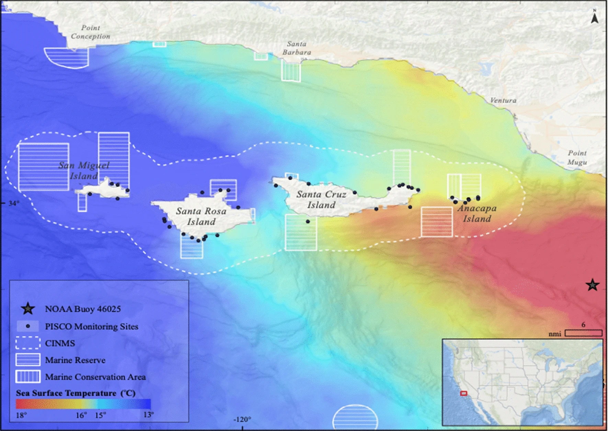

```{r include=FALSE}
knitr::opts_chunk$set(echo = T, message = F, warning = F)
```

# Motivation
  
California's Northern Channel Islands sit at the transition between two biogeographic provinces, the cold-water North Pacific and the warm-water Gulf of California. San Miguel and Santa Rosa Islands have species representative of the North Pacific province while Anacapa and Santa Barbara Islands sit firmly in the Gulf of California province. Santa Cruz Island lies in the transition zone with the western end of the island favoring North Pacific species and the eastern end favoring Gulf of California species. This makes the Northern Channel Islands a unique place to study how species distribution and recruitment respond to ocean temperatures.   

```{r}

```

|       Figure 1. The Southern California Bight (SCB) shown with a composite sea 
|       surface temperatures (SST) color gradient for 2009. This SST is typical of 
|       the region and illustrates the transition between the North Pacific and Gulf
|       of California biogegeographic provinces (Image taken from Freedman 2020).  
<br>

The El Niño Southern Oscillation ([ENSO](https://www.climate.gov/news-features/blogs/enso/what-el-ni%C3%B1o%E2%80%93southern-oscillation-enso-nutshell)) is measured primarily by the Oceanic Niño Index which calculates a SST [anomaly value](https://origin.cpc.ncep.noaa.gov/products/analysis_monitoring/ensostuff/ONI_change.shtml) value each month going back to 1950. These values are derived from SST in the equatorial pacific ($\pm5^{\circ}$ latitude, $120^{\circ}-170^{\circ}W$ longitude). The patterns of SST in this region are responsible for driving certain global weather and climate patterns. Despite the distance from this region, ENSO has a large effect on the oceanographic conditions of the SCB and the Channel Islands. This effect includes an influence on local SST as well as the strength and direction of ocean currents. These effects are known to influence the distribution and abundance of certain marine species ([Day 2018](https://www.frontiersin.org/articles/10.3389/fmars.2019.00497), [Freedman 2020](https://www.nature.com/articles/s41598-020-77885-3)). 

This analysis takes a shotgun approach to investigate which species are sensitive to either warm-water or cold-water events by using a series of species-level dynamic linear models with lag SST anomalies as predictor variables. These models will provide a broad overview of which species are affected, how they are affected, and whether or not the affect is statistically significant. This will inform our understanding of how species distribution and population ranges might be affected by changing oceanographic conditions due to climate change. 

# Data  

The Kelp Forest Monitoring (KFM) program at Channel Islands National Park has been collecting abundance and size distribution data of more than 170 species since 1982 (sampled annually). The park currently samples 33 sites at the five islands in the National Park. This data is publicly available and was requested and issued under a [scientific research and collecting permit](https://irma.nps.gov/RPRS/) (permit #: CHIS-2020-SCI-0006). These data are collected using scuba surveys where the biologists attempt to minimize their impact on the reef by using non-invasive sampling methods. This means that animals are counted in situ and no rocks are overturned or species removed. This inevitably biases the data towards adult populations of certain invertebrates that utilize crevice habitat during development as they will be hidden from direct observation.  

The fish data is collected in (#$/m^3$). In order to assure that all data are in the same units, only measurements of invertebrate and algae density (#$/m^2$) are retained. This takes the total number of species with density data from 151 down to 35. Using species density, we can identify trends in abundance observed over multiple El Niño (warm-water) and La Niña (cold-water) events. Using a dynamic linear model with lag independent variables we can see the effect of sea surface temperature anomalies during and in the years following these events on species density.

Below we read in ENSO data and calculate yearly mean anomalies before making 5 new columns with corresponding lag values. We then load in the species density data and filter out fish and 2 species which are exceedingly rare and do not have enough data to model. This leaves us with 33 species to model, all with the same units. 

```{r data}
# Load libraries
library(tidyverse)
library(here)
library(lubridate)
library(broom)
library(arrow)
library(plotly)

# Load and Tidy Data
oni_yearly <-  # Read in Oceanic Nino Index region 3.4 data
  read.table(
    "https://origin.cpc.ncep.noaa.gov/products/analysis_monitoring/ensostuff/detrend.nino34.ascii.txt",
    header = T) %>%
  # rename YR for joining tables
  dplyr::rename(SurveyYear = YR) %>% 
  dplyr::group_by(SurveyYear) %>% 
  # Calculate yearly SST Anom
  dplyr::summarise(SST_Anom = mean(ANOM)) %>% 
  # Create lagged SST
  dplyr::mutate(SST_Anom_1 = lag(SST_Anom, n = 1),
                SST_Anom_2 = lag(SST_Anom, n = 2),
                SST_Anom_3 = lag(SST_Anom, n = 3),
                SST_Anom_4 = lag(SST_Anom, n = 4),
                SST_Anom_5 = lag(SST_Anom, n = 5))


density <-  # Read in Density data
  arrow::read_feather("Density.feather") %>%
  dplyr::filter(Classification != "Fish",
                !CommonName %in% c("wakame, adult", 
                                   "wakame, juvenile", 
                                   "white abalone")) %>% 
  dplyr::left_join(oni_yearly)
```

# Analysis  

This analysis will use a general model formula of lm(Mean_Density ~ SST_Anom + SST_Anom_1 + SST_Anom_2 + SST_Anom_3 + SST_Anom_4 + SST_Anom_5) applied to density data grouped by each species scientific name. These five lag periods will show how a species is affected within the same year, and for the next five years following anomalous warm or cold water. We expect recruitment of certain species will either increases or decreases following warmer than usual or colder than usual ocean temperatures. Given what we know about the life cycle of many marine species, it is reasonable to assume these effects would not be detected by non-invasive sampling techniques for 1-5 years following anomalous temperatures.

This analysis is simplified to detect trends in a large number of species and does not take into account the effect of biogeography. This also does not consider the impact of marine protected areas (MPAs) which potentially buffer the ecological community from the effects of abiotic factors such as SST. MPAs could also have an effect from increased predation to some of these species, potentially limiting their abundance.

The cumulative effect on all species will be plotted. Then the results will be filtered to only include significant affects and sorted by the estimated slope of their relationship. The two species with the most positive slope and the two with the most negative slope will have their coefficients plotted over the lag periods. 

```{r }
Results_lag <- density %>% 
  dplyr::group_by(ScientificName) %>%
  dplyr::summarise(
    generics::tidy(
      stats::lm(
        Mean_Density ~ SST_Anom + SST_Anom_1 + SST_Anom_2 + SST_Anom_3 + SST_Anom_4 + SST_Anom_5
        ))) %>% 
  dplyr::filter(term != "(Intercept)") %>% 
  dplyr::mutate(significant = ifelse(p.value <= .05, "yes", "no"))
```

# Results

```{r }
Results_filtered <- Results_lag %>%
  dplyr::filter(p.value <= .05) %>% 
  dplyr::arrange(estimate) %>%
  dplyr::mutate(statistic = round(statistic, 3),
                p.value = round(p.value, 3),
                p.value = ifelse(p.value < 0.001, "< 0.001", as.character(p.value))) 
cold_sp <- Results_filtered %>% 
  arrange(estimate) %>% 
  distinct(ScientificName) %>% 
  head(3) %>% 
  pull()

warm_sp <- Results_filtered %>% 
  arrange(desc(estimate)) %>% 
  distinct(ScientificName) %>% 
  head(3) %>% 
  pull()

cold <- Results_lag %>% 
  group_by(ScientificName) %>% 
  mutate(cum_est = cumsum(estimate)) %>% 
  filter(ScientificName %in% cold_sp)

warm <- Results_lag %>% 
  group_by(ScientificName) %>% 
  mutate(cum_est = cumsum(estimate)) %>% 
  filter(ScientificName %in% warm_sp)

plt <- function(.data = cold) {
  ggplot(data = .data, aes(x = term, y = cum_est)) +
    geom_line(aes(color = ScientificName, group = ScientificName), size = 1) +
    geom_point(aes(shape = significant), size = 4) +
    scale_y_continuous(expand = c(0, 1)) +
    scale_x_discrete(labels = c("Current Year", "+1", "+2", "+3", "+4", "+5")) +
    scale_color_viridis_d(option = "D", end = .75, direction = -1) +
    labs(x = "Years relative to SST anomaly exposure", y = "Cumulative effect (sum of coefficients)",
         shape = "P-Val < .05?", color = "Species") +
    theme_classic() 
}
```

## Cold-water species

The two species with the largest negative cumulative effect were identified as _Strongylocentrotus purpuratus_ (purple sea urchin) and _Strongylocentrotus franciscanus_ (red sea urchin). Purple sea urchin seem to have the most extreme negative coefficients, suggesting that this species thrives under cold-water conditions. Red sea urchins have a similar though less extreme response to cold-water conditions. In both urchin species, the effect is significant in the same year, as well as the year following cold-water conditions. This makes sense, because despite non-invasive sampling, juvenile sea urchins as small as 1 mm have been recorded by KFM observers. 

_Patiria miniata_ (bat star) had the third most negative cumulative effect. This species is particularly affected by warm water, which tends to cause a form of sea star wasting disease (SSWD). Bat star populations take years to rebound following SSWD events. This slow recovery is seen in the cumulative effect which is statistically significant for the current period and for the following four years. 

```{r fig.height=5, fig.width=10}
plt()
```
|       Figure 2. The cumulative effect that SST anomalies have on the three species 
|       which have the largest negative slope estimates of all statistically significant
|       results. The effect accumulates from the current year to the following 5 years.  
<br>

## Warm-water species

_Sargassum horneri_ (devil weed) had the single most positive cumulative effect of any species. This is an invasive algae that has spread rapidly at the Channel Islands since its introduction to Catalina island in 2006 (Miller 2007). Predicting what factors contribute to the spread of _S. horneri_ will help scientist understand where to expect it next and what impacts it might have on the ecologic communities it settles in. Only the current year is seen to be positive, suggesting that _S. horneri_ juveniles are largely responsible for the effect.  

_Megastaea undosa_ (wavy turban snail) is an important grazing snail that is known to spawn in warm-water conditions which means that ENSO may be helpful in setting harvest quotas (Zacharias 2006). The effect is only significant 2, 3, and 4 years following a warm water event. I would argue that these snails spawn late in the year when the water is warmest and the sampling season is coming to a close. The following year, the juvenile snails are most likely missed as they are too cryptic. Then during the 2nd, 3rd, and 4th year, these animals are largest enough to be observed reliably. 

_Lytechinus anamesus_ likely follow the same pattern as _M. undosa_. I would be interested to investigate MPA effects on these lobster and sheephead snack-sized sea urchin (<40 mm typically).

```{r fig.height=5, fig.width=10}
plt(.data = warm)
```
|       Figure 3. The cumulative effect that SST anomalies have on the three species 
|       which have the largest positive slope estimates of all statistically significant 
|       results. The effect accumulates from the current year to the following 5 years.  
<br> 
# Future Work  

## Better Models

Include biogeogrphic regions to see how species abundance is affected by region. I would also like to include MPA status to identify if there are any buffer effects provided by the MPA, or impacts to prey species from increased preddation.  

## More Protocols/Species

This analysis only uses 2 out of 13 sampling protocols of the KFM program. The analysis could be expanded to include data from the two fish surveys, as well as percent cover data from random point contacts survey.  

## Integrate Program Data

This analysis could be made more robust by including data from the Partnership for Interdisciplinary Study of Coastal Oceans (PISCO), which conducts similar monitoring efforts around the Channel Islands. 


# Code Availability

[GitHub Repository with all code and data available at this link.](https://github.com/cullen-molitor/cullen-molitor.github.io/tree/main/_posts/2021-12-01-eds-222-final-project-species-density-sst)  

# Literature Cited 

Costello, M.J., Tsai, P., Wong, P.S. et al. Marine biogeographic realms and species endemicity. Nat Commun 8, 1057 (2017). https://doi.org/10.1038/s41467-017-01121-2

Day, P. B., Stuart-Smith, R. D., Edgar, G. J. & Bates, A. E. Species’ thermal ranges predict changes in reef fish community structure during 8 years of extreme temperature variation. Divers. Distrib. 24, 1036–1046 (2018).

Freedman, R.M., Brown, J.A., Caldow, C. et al. Marine protected areas do not prevent marine heatwave-induced fish community structure changes in a temperate transition zone. Sci Rep 10, 21081 (2020). https://doi.org/10.1038/s41598-020-77885-3

Horta e Costa, B. Tropicalization of fish assemblages in temperate biogeographic transition zones. Mar. Ecol. Prog. Ser. 504, 241–252 (2014).

Miller, K. A., Engle, J. M., Uwai, S., & Kawai, H. (2007). First report of the asian seaweed sargassum filicinum harvey (fucales) in california, usa. Biological Invasions, (9), 609-613.

Wernberg, T. S. et al. Climate-driven regime shift of a temperate marine ecosystem. Science 353, 169–172 (2016).

Zacharias, Mark, and David J. Kushner. 2006. “Sea temperature and wave height as predictors of population size structure and density of Megastraea (Lithopoma) undosa: Implications for fishery management.” Bulletin of Marine Science 79.1: 71-82.


<hr>

  |   |  
--- | --- | ---
 |  | 


