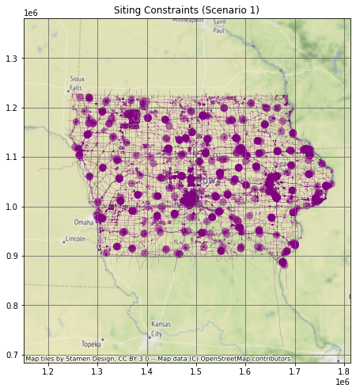
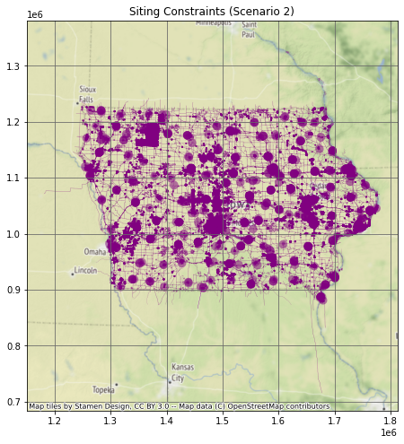
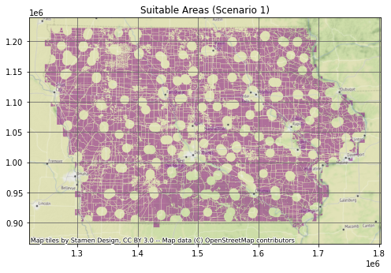
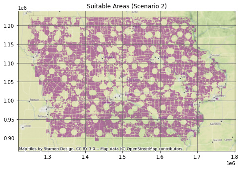

## Import Modules

```python
import sqlalchemy as sa
import geopandas as gpd
import pandas as pd
import matplotlib.pyplot as plt
import contextily as ctx
import math
%matplotlib inline
```

## Database Connection


```python
pg_uri_template = 'postgresql+psycopg2://{user}:{pwd}@{host}/{db_name}'
db_uri = pg_uri_template.format(
    drivername='postgresql+psycopg2',
    host = '{ip address}',
    user = '{username}',
    pwd = '{pwd}',
    db_name = 'osmiowa'
)
engine = sa.create_engine(db_uri)
```

## Data Details
Database Name:
- osmiowa  

Database Tables:
- planet_osm_line
- planet_osm_point
- planet_osm_polygon
- planet_osm_roads
- spatial_ref_sys
- wind
- wind_cells

Geometry:
- Projected in [EPSG:26975](https://epsg.io/26975) 
- Geodetic CRS: NAD83
- Units: meters
- Coordinate system: Cartesian 2D CS
- Axes: easting, northing (X,Y)
- Orientations: east, north

# Query Database

Residential Scenario 1 (3H)

```python
sql_buildings_residential_1 = \
"""
SELECT 
    ST_BUFFER(way, 450) as way
FROM 
    planet_osm_polygon 
WHERE 
    building IN ('yes', 'residential', 'apartments', 'house', 'static_caravan', 'detached')
OR 
    landuse = 'residential'
OR 
    place = 'town'
"""
```
Residential Scenario 2 (10H)


```python
sql_buildings_residential_2 = \
"""
SELECT 
    ST_BUFFER(way, 1500) as way 
FROM 
    planet_osm_polygon 
WHERE 
    building 
IN 
    ('yes', 'residential', 'apartments', 'house', 'static_caravan', 'detached')
OR 
    landuse = 'residential'
OR
    place = 'town'
"""
```
Non-residential (3H)


```python
sql_buildings_nonresidential = \
"""
SELECT 
    ST_BUFFER(way, 450) as way
FROM 
    planet_osm_polygon 
WHERE 
    building 
NOT IN 
    ('yes', 'residential', 'apartments', 'house', 'static_caravan', 'detached')
"""
```
Airports

```python
sql_airports = \
"""
SELECT 
    ST_BUFFER(way, 7500) as way
FROM 
    planet_osm_polygon 
WHERE 
    aeroway IS NOT NULL
"""
```
Military Bases

```python
sql_military = \
"""
SELECT 
    ST_BUFFER(way, 0) as way 
FROM 
    planet_osm_polygon 
WHERE 
    military IS NOT NULL
OR 
    landuse = 'military'
"""
```
Railways and Roads

```python
sql_railways_n_roads = \
"""
SELECT 
    ST_BUFFER(way, 300) as way
FROM 
    planet_osm_line 
WHERE 
    (railway IS NOT NULL
     AND railway 
     NOT IN ('abandoned', 'disused', 'razed', 'dismantled'))
OR 
    (highway IS NOT NULL
AND 
    highway 
IN 
    ('motorway', 'motorway_link', 'trunk', 'trunk_link', 'road',
    'primary', 'primary_link', 'secondary', 'secondary_link'))
"""
```
Nature Reserves, Parks, and Wetlands

```python
sql_nature = \
"""
SELECT 
    way 
FROM 
    planet_osm_polygon 
WHERE 
    leisure 
IN 
    ('nature_reserve', 'park')
OR
    "natural" 
IN 
    ('wetland')
"""
```
Rivers

```python
sql_rivers = \
"""
SELECT 
    ST_BUFFER(way, 150) as way 
FROM 
    planet_osm_line 
WHERE 
    waterway 
IN 
    ('river')
"""
```
Lakes

```python
sql_lakes = \
"""
SELECT
    way
FROM 
    planet_osm_polygon
WHERE 
    water 
IN 
    ('lake', 'reservoir', 'pond')
"""
```
Power Lines

```python
sql_powerlines = \
"""
SELECT 
    ST_BUFFER(way, 300) as way
FROM 
    planet_osm_line 
WHERE 
    power IS NOT NULL
"""
```
Power Plants

```python
sql_powerplants = \
"""
SELECT 
    ST_BUFFER(way, 150) as way
FROM 
    planet_osm_polygon 
WHERE 
    power IS NOT NULL
"""
```
Wind Turbines


```python
sql_turbines = \
"""
SELECT
    ST_BUFFER(way, 680) as way
FROM 
    planet_osm_point 
WHERE 
    "generator:source" IS NOT NULL
AND 
    "generator:source" IN ('wind')
"""
```
## Merge Subqueries

### Scenario 1 

```python
sql_siting_constraints = \
f"""
{sql_buildings_residential_1} 
UNION
{sql_buildings_nonresidential} 
UNION
{sql_airports} 
UNION
{sql_military} 
UNION
{sql_railways_n_roads} 
UNION
{sql_nature} 
UNION
{sql_rivers} 
UNION
{sql_lakes} 
UNION
{sql_powerlines}
UNION
{sql_powerplants}
UNION
{sql_turbines}
"""
siting_constraints = gpd.read_postgis(sql_siting_constraints, con = engine, geom_col = 'way')
```

### Scenario 2


```python
sql_siting_constraints_2 = \
f"""
{sql_buildings_residential_2} 
UNION
{sql_buildings_nonresidential} 
UNION
{sql_airports} 
UNION
{sql_military} 
UNION
{sql_railways_n_roads} 
UNION
{sql_nature} 
UNION
{sql_rivers} 
UNION
{sql_lakes} 
UNION
{sql_powerlines}
UNION
{sql_powerplants}
UNION
{sql_turbines}
"""
siting_constraints_2 = gpd.read_postgis(sql_siting_constraints_2, con = engine, geom_col = 'way')
```

```python
fig, ax = plt.subplots(figsize=(8, 8))
siting_constraints.plot(ax = ax, markersize = .1, color = "purple", alpha = .5)
ax.grid(True, color = 'dimgray')
ax.set_title('Siting Constraints (Scenario 1)', fontsize=12)
ax.ticklabel_format(scilimits =  [-5, 5])
ctx.add_basemap(ax, crs="EPSG:26975")
```


```python
fig, ax = plt.subplots(figsize=(8, 8))
siting_constraints_2.plot(ax = ax, markersize = .1, color = "purple", alpha = .5)
ax.grid(True, color = 'dimgray')
ax.set_title('Siting Constraints (Scenario 2)', fontsize=12)
ax.ticklabel_format(scilimits =  [-5, 5])
ctx.add_basemap(ax, crs="EPSG:26975")
```
 


## Wind Data
The table wind_cells_10000 contains 10 km2 square polygons with associated average annual wind speeds (m s-1), arranged to cover Iowa in a ragged grid.

```python
sql_wind_speeds = \
"""
SELECT * 
FROM 
    wind_cells_10000 
WHERE 
    wind_speed IS NOT NULL
"""
wind_speeds = gpd.read_postgis(sql_wind_speeds, con = engine, geom_col = 'geom')
```

# Results
## Scenario #1
### Subtract Siting Constraints from Wind Cells 

```python
suitable_cells = wind_speeds.overlay(siting_constraints, how = 'difference', keep_geom_type = False)
```

### Plot Suitable Wind Cells


```python
fig, ax = plt.subplots(figsize=(8, 8))
suitable_cells.plot(ax = ax, markersize = .1, color = "purple", alpha = .5)
ax.grid(True, color = 'dimgray')
ax.set_title('Suitable Areas (Scenario 1)', fontsize=12)
ax.ticklabel_format(scilimits =  [-5, 5])
ctx.add_basemap(ax, crs="EPSG:26975")
```


    

    


### Find Number of Turbines


```python
rotor_5x = math.pi * (136 * 5) ** 2
suitable_cells["area"] = suitable_cells['geom'].area
suitable_cells["number_wind_turbines"] = suitable_cells['geom'].area / rotor_5x
```


```python
total_wind_turbines = suitable_cells["number_wind_turbines"].sum()
print("The total number of turbines in scenario 1 is:", round(total_wind_turbines))
```

    The total number of turbines in scenario 1 is: 57286
    

### Power production


```python
suitable_cells['energy_per_turbine'] = 2.6 * suitable_cells['wind_speed'] - 5
suitable_cells['power_per_cell'] = suitable_cells['energy_per_turbine'] * suitable_cells['number_wind_turbines']
```

### Total Power Production 


```python
total_scenario_1 = suitable_cells['power_per_cell'].sum()
print("The total power produced in scenario 1 is:", round(total_scenario_1), "GWH/year")
```

    The total power produced in scenario 1 is: 1064159 GWH/year
    

## Scenario #2
### Subtract Siting Constraints from Wind Cells


```python
suitable_cells_2 = wind_speeds.overlay(siting_constraints_2, how = 'difference', keep_geom_type = False)
```

### Plot Suitable Wind Cells


```python
fig, ax = plt.subplots(figsize=(8, 8))
suitable_cells_2.plot(ax = ax, markersize = .1, color = "purple", alpha = .5)
ax.grid(True, color = 'dimgray')
ax.set_title('Suitable Areas (Scenario 2)', fontsize=12)
ax.ticklabel_format(scilimits =  [-5, 5])
ctx.add_basemap(ax, crs="EPSG:26975")
```


    

    


### Find Number of Turbines


```python
rotor_5x = math.pi * (136 * 5) ** 2
suitable_cells_2["area"] = suitable_cells_2['geom'].area
suitable_cells_2["number_wind_turbines"] = suitable_cells_2['geom'].area / rotor_5x
```


```python
total_wind_turbines_2 = suitable_cells_2["number_wind_turbines"].sum()
print("The total number of turbines in scenario 2 is:", round(total_wind_turbines_2))
```

    The total number of turbines in scenario 2 is: 52055
    

### Power Production


```python
suitable_cells_2['energy_per_turbine'] = 2.6 * suitable_cells_2['wind_speed'] - 5
suitable_cells_2['power_per_cell'] = suitable_cells_2['energy_per_turbine'] * suitable_cells_2['number_wind_turbines']
wind_speeds
```


<div>
<style scoped>
    .dataframe tbody tr th:only-of-type {
        vertical-align: middle;
    }

    .dataframe tbody tr th {
        vertical-align: top;
    }

    .dataframe thead th {
        text-align: right;
    }
</style>
<table border="1" class="dataframe">
  <thead>
    <tr style="text-align: right;">
      <th></th>
      <th>id</th>
      <th>geom</th>
      <th>wind_speed</th>
    </tr>
  </thead>
  <tbody>
    <tr>
      <th>0</th>
      <td>1</td>
      <td>POLYGON ((1256222.769 1212179.582, 1266222.769...</td>
      <td>9.336039</td>
    </tr>
    <tr>
      <th>1</th>
      <td>2</td>
      <td>POLYGON ((1266222.769 1212179.582, 1276222.769...</td>
      <td>9.097315</td>
    </tr>
    <tr>
      <th>2</th>
      <td>3</td>
      <td>POLYGON ((1276222.769 1212179.582, 1286222.769...</td>
      <td>8.984566</td>
    </tr>
    <tr>
      <th>3</th>
      <td>4</td>
      <td>POLYGON ((1286222.769 1212179.582, 1296222.769...</td>
      <td>9.266137</td>
    </tr>
    <tr>
      <th>4</th>
      <td>5</td>
      <td>POLYGON ((1296222.769 1212179.582, 1306222.769...</td>
      <td>9.296747</td>
    </tr>
    <tr>
      <th>...</th>
      <td>...</td>
      <td>...</td>
      <td>...</td>
    </tr>
    <tr>
      <th>1437</th>
      <td>1438</td>
      <td>POLYGON ((1686222.769 902179.582, 1696222.769 ...</td>
      <td>8.678687</td>
    </tr>
    <tr>
      <th>1438</th>
      <td>1439</td>
      <td>POLYGON ((1426222.769 892179.582, 1436222.769 ...</td>
      <td>9.114730</td>
    </tr>
    <tr>
      <th>1439</th>
      <td>1440</td>
      <td>POLYGON ((1656222.769 892179.582, 1666222.769 ...</td>
      <td>8.237385</td>
    </tr>
    <tr>
      <th>1440</th>
      <td>1441</td>
      <td>POLYGON ((1666222.769 892179.582, 1676222.769 ...</td>
      <td>8.423034</td>
    </tr>
    <tr>
      <th>1441</th>
      <td>1442</td>
      <td>POLYGON ((1666222.769 882179.582, 1676222.769 ...</td>
      <td>8.109468</td>
    </tr>
  </tbody>
</table>
<p>1442 rows × 3 columns</p>
</div>


### Total Power Production


```python
total_scenario_2 = suitable_cells_2['power_per_cell'].sum()
print("The total power produced in scenario 2 is:", round(total_scenario_2), " GWH/year")
```

    The total power produced in scenario 2 is: 967009  GWH/year
    
