```{css include = F}
.scrollit {
    overflow:scroll;
    height:250px;
  }
```

# Homework # 3
## Protecting Whales From Ships
Group # 2  
Cullen Molitor  
Amber McEldowney 

## Setup

### Import Modules


```python
import geopandas as gpd 
import rasterio as rio
from rasterio.plot import show
import numpy as np
import pandas as pd
import matplotlib.image as mpimg
import matplotlib.pyplot as plt
import os
import glob
import contextily as ctx
import shapely
from shapely.geometry import Polygon
%matplotlib inline
```

### Parameters


```python
shoreline_shapefile  = 'data/dominica/dma_admn_adm0_py_s1_dominode_v2.shp'
whales_CSV           = 'data/sightings2005_2018.csv'
vessels_CSV          = 'data/station1249.csv'
```

### Constants


```python
ten_kn_in_ms = 5.14
projected_EPSG = 2002   # Dominica 1945 / British West Indies Grid
geodetic_EPSG  = 4326   # WGS 84 (use as default CRS for incoming latlon)
```

## Load Dominica Shape File


```python
dominica_shp = gpd.read_file(shoreline_shapefile)
```


```python
dominica_shp.head()
```


<div>
<style scoped>
    .dataframe tbody tr th:only-of-type {
        vertical-align: middle;
    }

    .dataframe tbody tr th {
        vertical-align: top;
    }

    .dataframe thead th {
        text-align: right;
    }
</style>
<table border="1" class="dataframe">
  <thead>
    <tr style="text-align: right;">
      <th></th>
      <th>ADM0_PCODE</th>
      <th>ADM0_EN</th>
      <th>geometry</th>
    </tr>
  </thead>
  <tbody>
    <tr>
      <th>0</th>
      <td>DM</td>
      <td>Dominica</td>
      <td>POLYGON ((-61.43023 15.63952, -61.43019 15.639...</td>
    </tr>
  </tbody>
</table>
</div>


### Inspect CRS


```python
dominica_shp.crs
```


    <Geographic 2D CRS: EPSG:4326>
    Name: WGS 84
    Axis Info [ellipsoidal]:
    - Lat[north]: Geodetic latitude (degree)
    - Lon[east]: Geodetic longitude (degree)
    Area of Use:
    - name: World.
    - bounds: (-180.0, -90.0, 180.0, 90.0)
    Datum: World Geodetic System 1984 ensemble
    - Ellipsoid: WGS 84
    - Prime Meridian: Greenwich


### Set CRS
[EPSG 2002](https://epsg.io/2002)


```python
dominica_shp = dominica_shp.to_crs(projected_EPSG)
```


```python
dominica_shp.crs
```


    <Projected CRS: EPSG:2002>
    Name: Dominica 1945 / British West Indies Grid
    Axis Info [cartesian]:
    - E[east]: Easting (metre)
    - N[north]: Northing (metre)
    Area of Use:
    - name: Dominica - onshore.
    - bounds: (-61.55, 15.14, -61.2, 15.69)
    Coordinate Operation:
    - name: British West Indies Grid
    - method: Transverse Mercator
    Datum: Dominica 1945
    - Ellipsoid: Clarke 1880 (RGS)
    - Prime Meridian: Greenwich


### Plot Dominica


```python
fig, ax = plt.subplots(figsize=(5, 5))
ax.grid(True, color = 'dimgray')
ax.set(ylim=(1.67e6,1.74e6), xlim=(445000, 490000))
ax.ticklabel_format(scilimits =  [-5, 5])
dominica_shp.plot(ax = ax, edgecolor = "k", facecolor="None")
ctx.add_basemap(ax, crs=projected_EPSG)
```


    
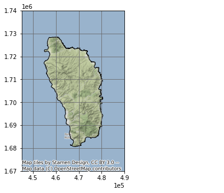
    


## Load Whale Sightings Data


```python
whales = gpd.read_file(whales_CSV)
whales
```


<div>
<style scoped>
    .dataframe tbody tr th:only-of-type {
        vertical-align: middle;
    }

    .dataframe tbody tr th {
        vertical-align: top;
    }

    .dataframe thead th {
        text-align: right;
    }
</style>
<table border="1" class="dataframe">
  <thead>
    <tr style="text-align: right;">
      <th></th>
      <th>field_1</th>
      <th>GPStime</th>
      <th>Lat</th>
      <th>Long</th>
      <th>geometry</th>
    </tr>
  </thead>
  <tbody>
    <tr>
      <th>0</th>
      <td>0</td>
      <td>2005-01-15 07:43:27</td>
      <td>15.36977117</td>
      <td>-61.49328433</td>
      <td>None</td>
    </tr>
    <tr>
      <th>1</th>
      <td>1</td>
      <td>2005-01-15 08:07:13</td>
      <td>15.3834075</td>
      <td>-61.503702</td>
      <td>None</td>
    </tr>
    <tr>
      <th>2</th>
      <td>2</td>
      <td>2005-01-15 08:31:17</td>
      <td>15.38106333</td>
      <td>-61.50486067</td>
      <td>None</td>
    </tr>
    <tr>
      <th>3</th>
      <td>3</td>
      <td>2005-01-15 09:19:10</td>
      <td>15.33532083</td>
      <td>-61.46858117</td>
      <td>None</td>
    </tr>
    <tr>
      <th>4</th>
      <td>4</td>
      <td>2005-01-15 10:08:00</td>
      <td>15.294224</td>
      <td>-61.45318517</td>
      <td>None</td>
    </tr>
    <tr>
      <th>...</th>
      <td>...</td>
      <td>...</td>
      <td>...</td>
      <td>...</td>
      <td>...</td>
    </tr>
    <tr>
      <th>4888</th>
      <td>4888</td>
      <td>2018-05-25 12:01:25</td>
      <td>15.39195</td>
      <td>-61.572</td>
      <td>None</td>
    </tr>
    <tr>
      <th>4889</th>
      <td>4889</td>
      <td>2018-05-25 13:08:29</td>
      <td>15.4189</td>
      <td>-61.5833</td>
      <td>None</td>
    </tr>
    <tr>
      <th>4890</th>
      <td>4890</td>
      <td>2018-05-25 14:50:00</td>
      <td>15.443483</td>
      <td>-61.60995</td>
      <td>None</td>
    </tr>
    <tr>
      <th>4891</th>
      <td>4891</td>
      <td>2018-05-25 15:57:34</td>
      <td>15.499866</td>
      <td>-61.638333</td>
      <td>None</td>
    </tr>
    <tr>
      <th>4892</th>
      <td>4892</td>
      <td>2018-05-25 16:17:10</td>
      <td>15.494783</td>
      <td>-61.6482</td>
      <td>None</td>
    </tr>
  </tbody>
</table>
<p>4893 rows × 5 columns</p>
</div>


### Create GeoDataFrame


```python
points = gpd.points_from_xy(whales['Long'], whales['Lat'], crs = geodetic_EPSG)
```


```python
whales_gdf = gpd.GeoDataFrame(whales, geometry = points)
```

### Set CRS


```python
whales_gdf = whales_gdf.to_crs(projected_EPSG)
```

### Plot Whale Sightings


```python
fig, ax = plt.subplots(figsize = (10, 10))
ax.set_aspect('equal')
ax.grid(True, color = 'dimgray')
ax.set(xlim=(4e5, 5e5), ylim=(1.5e6, 1.8e6))
dominica_shp.plot(ax = ax, color='None', edgecolor = "k")
whales_gdf.plot(ax = ax, markersize = .1, color = "purple", alpha = .25)
ax.set_title('Whale Sightings', fontsize=12)
ax.ticklabel_format(scilimits =  [-5, 5])
ctx.add_basemap(ax, crs = projected_EPSG)
```


    
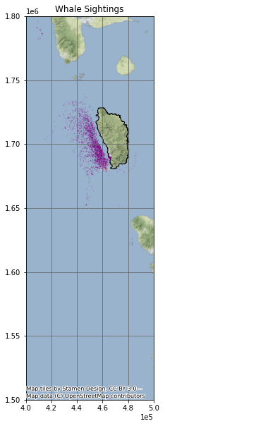
    


## Create Grid


```python
xmin, ymin, xmax, ymax = whales_gdf.total_bounds
```


```python
cell_size = 2000
```


```python
xs = list(np.arange(xmin, xmax + cell_size, cell_size))
ys = list(np.arange(ymin, ymax + cell_size, cell_size))
```


```python
def make_cell(x, y, cell_size):
    ring = [
        (x, y),
        (x + cell_size, y),
        (x + cell_size, y + cell_size),
        (x, y + cell_size)
    ]
    cell = shapely.geometry.Polygon(ring)
    return cell
```


```python
cells = []
for x in xs:
    for y in ys:
        cell = make_cell(x, y, cell_size)
        cells.append(cell)
```

### Create GeoDataFrame


```python
grid = gpd.GeoDataFrame({'geometry': cells}, crs = geodetic_EPSG)
```

### Set CRS


```python
grid = grid.set_geometry(crs = projected_EPSG, col = grid['geometry'])
```

### Plot Grid


```python
grid.plot(facecolor = "none", figsize = (10, 10), linewidth = 1)
```


    <AxesSubplot:>


    
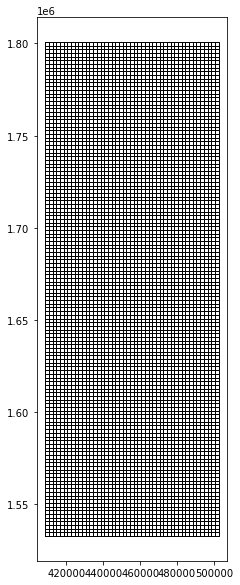
    


## Extract Whale Habitat


```python
whale_grid = grid.sjoin(whales_gdf, how="inner")
```

### Plot Whale Grid


```python
whale_grid.plot(facecolor = "none", figsize = (10, 10), linewidth = .75)
```


    <AxesSubplot:>


    
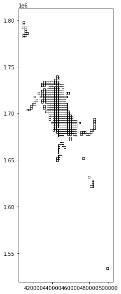
    


### Summarise Whale Counts


```python
grid['count'] = whale_grid.groupby(whale_grid.index).count()['index_right']
```

### Find Primary Whale Habitat


```python
grid = grid[grid['count'] > 20]
```

### Plot Whale Habitat


```python
grid.plot(facecolor = "none", figsize = (10, 10), linewidth = .75)
```


    <AxesSubplot:>


    
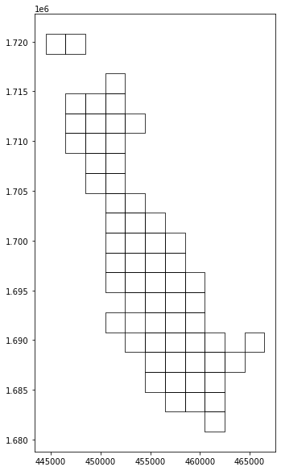
    


### Create Unary Union


```python
grid_union = grid.unary_union
```


```python
grid_union
```


    
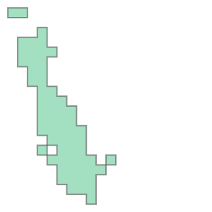
    


### Create Vessel Speed Reduction Zone
The vessel speed reduction zone is determined by the whale habitat areas in which more than 20 whales were observed per 2,000 m². 


```python
grid_convex = grid_union.convex_hull
```


```python
grid_convex
```


    
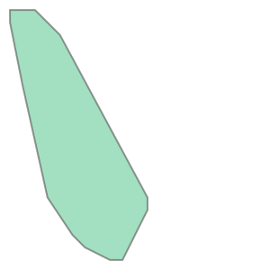
    


### Make GeoDataFrame


```python
whale_habitat = gpd.GeoDataFrame(index = [0], geometry = [grid_convex], crs = projected_EPSG)
```

### Plot Whale Habitat


```python
fig, ax = plt.subplots(figsize = (10, 10))
ax.grid(True, color = 'dimgray')
ax.set(xlim=(4.4e5, 4.85e5), ylim=(1.675e6, 1.73e6))
dominica_shp.plot(ax = ax, color='None', edgecolor = "k")
whale_habitat.plot(ax = ax, edgecolor = "purple", facecolor = 'none')
ax.set_title('Whale Habitat', fontsize=12)
ax.ticklabel_format(scilimits =  [-5, 5])
ctx.add_basemap(ax, crs = projected_EPSG)
```


    
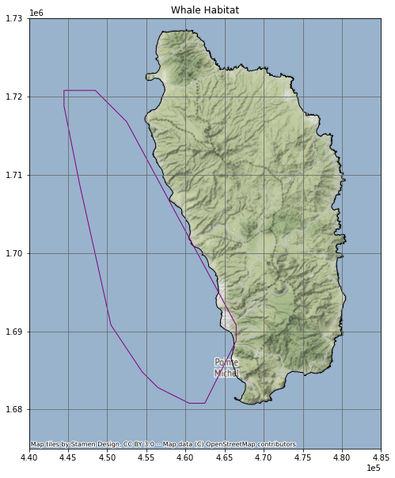
    


```python
whale_habitat_diff = whale_habitat.difference(dominica_shp)
whale_habitat = gpd.GeoDataFrame(geometry = whale_habitat_diff)
whale_habitat
```


<div>
<style scoped>
    .dataframe tbody tr th:only-of-type {
        vertical-align: middle;
    }

    .dataframe tbody tr th {
        vertical-align: top;
    }

    .dataframe thead th {
        text-align: right;
    }
</style>
<table border="1" class="dataframe">
  <thead>
    <tr style="text-align: right;">
      <th></th>
      <th>geometry</th>
    </tr>
  </thead>
  <tbody>
    <tr>
      <th>0</th>
      <td>POLYGON ((456480.652 1682792.746, 454480.652 1...</td>
    </tr>
  </tbody>
</table>
</div>


```python
fig, ax = plt.subplots(figsize = (10, 10))
ax.grid(True, color = 'dimgray')
ax.set(xlim=(4.4e5, 4.85e5), ylim=(1.675e6, 1.73e6))
dominica_shp.plot(ax = ax, color='None', edgecolor = "k")
whale_habitat.plot(ax = ax, edgecolor = "purple", facecolor = 'none')
ax.set_title('Whale Habitat', fontsize=12)
ax.ticklabel_format(scilimits =  [-5, 5])
ctx.add_basemap(ax, crs = projected_EPSG)
```


    
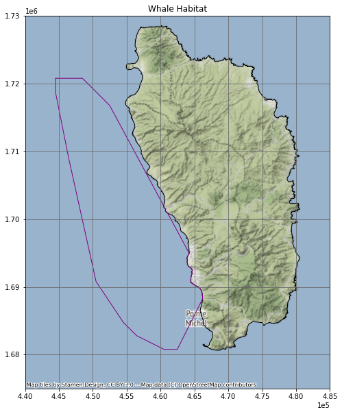
    


```python
whale_habitat
```


<div>
<style scoped>
    .dataframe tbody tr th:only-of-type {
        vertical-align: middle;
    }

    .dataframe tbody tr th {
        vertical-align: top;
    }

    .dataframe thead th {
        text-align: right;
    }
</style>
<table border="1" class="dataframe">
  <thead>
    <tr style="text-align: right;">
      <th></th>
      <th>geometry</th>
    </tr>
  </thead>
  <tbody>
    <tr>
      <th>0</th>
      <td>POLYGON ((456480.652 1682792.746, 454480.652 1...</td>
    </tr>
  </tbody>
</table>
</div>


## Load AIS Vessel Data


```python
vessels = gpd.read_file(vessels_CSV)
```


```python
points = gpd.points_from_xy(vessels['LON'], vessels['LAT'], crs = geodetic_EPSG)
```

### Create GeoDataFrame


```python
vessels_gdf = gpd.GeoDataFrame(vessels, geometry = points)
```


```python
vessels_gdf
```


<div>
<style scoped>
    .dataframe tbody tr th:only-of-type {
        vertical-align: middle;
    }

    .dataframe tbody tr th {
        vertical-align: top;
    }

    .dataframe thead th {
        text-align: right;
    }
</style>
<table border="1" class="dataframe">
  <thead>
    <tr style="text-align: right;">
      <th></th>
      <th>field_1</th>
      <th>MMSI</th>
      <th>LON</th>
      <th>LAT</th>
      <th>TIMESTAMP</th>
      <th>geometry</th>
    </tr>
  </thead>
  <tbody>
    <tr>
      <th>0</th>
      <td>0</td>
      <td>233092000</td>
      <td>-61.84788</td>
      <td>15.23238</td>
      <td>2015-05-22 13:53:26</td>
      <td>POINT (-61.84788 15.23238)</td>
    </tr>
    <tr>
      <th>1</th>
      <td>1</td>
      <td>255803280</td>
      <td>-61.74397</td>
      <td>15.96114</td>
      <td>2015-05-22 13:52:57</td>
      <td>POINT (-61.74397 15.96114)</td>
    </tr>
    <tr>
      <th>2</th>
      <td>2</td>
      <td>329002300</td>
      <td>-61.38968</td>
      <td>15.29744</td>
      <td>2015-05-22 13:52:32</td>
      <td>POINT (-61.38968 15.29744)</td>
    </tr>
    <tr>
      <th>3</th>
      <td>3</td>
      <td>257674000</td>
      <td>-61.54395</td>
      <td>16.2334</td>
      <td>2015-05-22 13:52:24</td>
      <td>POINT (-61.54395 16.23340)</td>
    </tr>
    <tr>
      <th>4</th>
      <td>4</td>
      <td>636092006</td>
      <td>-61.52401</td>
      <td>15.81954</td>
      <td>2015-05-22 13:51:23</td>
      <td>POINT (-61.52401 15.81954)</td>
    </tr>
    <tr>
      <th>...</th>
      <td>...</td>
      <td>...</td>
      <td>...</td>
      <td>...</td>
      <td>...</td>
      <td>...</td>
    </tr>
    <tr>
      <th>617257</th>
      <td>238722</td>
      <td>256525000</td>
      <td>-61.40679</td>
      <td>15.36907</td>
      <td>2015-05-21 21:34:59</td>
      <td>POINT (-61.40679 15.36907)</td>
    </tr>
    <tr>
      <th>617258</th>
      <td>238723</td>
      <td>311077100</td>
      <td>-61.37539</td>
      <td>15.27406</td>
      <td>2015-05-21 21:34:55</td>
      <td>POINT (-61.37539 15.27406)</td>
    </tr>
    <tr>
      <th>617259</th>
      <td>238724</td>
      <td>377907247</td>
      <td>-61.39461</td>
      <td>15.30672</td>
      <td>2015-05-21 21:34:46</td>
      <td>POINT (-61.39461 15.30672)</td>
    </tr>
    <tr>
      <th>617260</th>
      <td>238725</td>
      <td>253365000</td>
      <td>-61.49001</td>
      <td>16.14007</td>
      <td>2015-05-21 21:34:46</td>
      <td>POINT (-61.49001 16.14007)</td>
    </tr>
    <tr>
      <th>617261</th>
      <td>238726</td>
      <td>329002300</td>
      <td>-61.48073</td>
      <td>15.44751</td>
      <td>2015-05-21 21:34:45</td>
      <td>POINT (-61.48073 15.44751)</td>
    </tr>
  </tbody>
</table>
<p>617262 rows × 6 columns</p>
</div>


### Set CRS


```python
vessels_gdf = vessels_gdf.to_crs(projected_EPSG)
```

### Make TIMESTAMP datetime


```python
vessels_gdf['TIMESTAMP'] = pd.to_datetime(vessels_gdf['TIMESTAMP'])
```

### Select Vessels Inside Whale Habitat


```python
vessels_whale = vessels_gdf.sjoin(whale_habitat, how = 'inner')
```


```python
vessels_whale
```


<div>
<style scoped>
    .dataframe tbody tr th:only-of-type {
        vertical-align: middle;
    }

    .dataframe tbody tr th {
        vertical-align: top;
    }

    .dataframe thead th {
        text-align: right;
    }
</style>
<table border="1" class="dataframe">
  <thead>
    <tr style="text-align: right;">
      <th></th>
      <th>field_1</th>
      <th>MMSI</th>
      <th>LON</th>
      <th>LAT</th>
      <th>TIMESTAMP</th>
      <th>geometry</th>
      <th>index_right</th>
    </tr>
  </thead>
  <tbody>
    <tr>
      <th>2</th>
      <td>2</td>
      <td>329002300</td>
      <td>-61.38968</td>
      <td>15.29744</td>
      <td>2015-05-22 13:52:32</td>
      <td>POINT (464555.392 1690588.725)</td>
      <td>0</td>
    </tr>
    <tr>
      <th>7</th>
      <td>7</td>
      <td>338143127</td>
      <td>-61.39575</td>
      <td>15.33418</td>
      <td>2015-05-22 13:50:54</td>
      <td>POINT (463892.452 1694650.397)</td>
      <td>0</td>
    </tr>
    <tr>
      <th>13</th>
      <td>13</td>
      <td>329002300</td>
      <td>-61.38968</td>
      <td>15.29745</td>
      <td>2015-05-22 13:48:32</td>
      <td>POINT (464555.389 1690589.831)</td>
      <td>0</td>
    </tr>
    <tr>
      <th>15</th>
      <td>15</td>
      <td>338143015</td>
      <td>-61.39558</td>
      <td>15.33423</td>
      <td>2015-05-22 13:47:31</td>
      <td>POINT (463910.683 1694655.978)</td>
      <td>0</td>
    </tr>
    <tr>
      <th>16</th>
      <td>16</td>
      <td>338143127</td>
      <td>-61.39757</td>
      <td>15.33139</td>
      <td>2015-05-22 13:47:25</td>
      <td>POINT (463697.964 1694341.275)</td>
      <td>0</td>
    </tr>
    <tr>
      <th>...</th>
      <td>...</td>
      <td>...</td>
      <td>...</td>
      <td>...</td>
      <td>...</td>
      <td>...</td>
      <td>...</td>
    </tr>
    <tr>
      <th>617252</th>
      <td>238717</td>
      <td>329002300</td>
      <td>-61.4885</td>
      <td>15.4706</td>
      <td>2015-05-21 21:37:45</td>
      <td>POINT (453901.647 1709712.916)</td>
      <td>0</td>
    </tr>
    <tr>
      <th>617253</th>
      <td>238718</td>
      <td>338143015</td>
      <td>-61.39553</td>
      <td>15.33448</td>
      <td>2015-05-21 21:37:14</td>
      <td>POINT (463915.972 1694683.643)</td>
      <td>0</td>
    </tr>
    <tr>
      <th>617255</th>
      <td>238720</td>
      <td>338143127</td>
      <td>-61.39563</td>
      <td>15.33468</td>
      <td>2015-05-21 21:35:12</td>
      <td>POINT (463905.177 1694705.734)</td>
      <td>0</td>
    </tr>
    <tr>
      <th>617259</th>
      <td>238724</td>
      <td>377907247</td>
      <td>-61.39461</td>
      <td>15.30672</td>
      <td>2015-05-21 21:34:46</td>
      <td>POINT (464023.288 1691613.624)</td>
      <td>0</td>
    </tr>
    <tr>
      <th>617261</th>
      <td>238726</td>
      <td>329002300</td>
      <td>-61.48073</td>
      <td>15.44751</td>
      <td>2015-05-21 21:34:45</td>
      <td>POINT (454741.236 1707161.130)</td>
      <td>0</td>
    </tr>
  </tbody>
</table>
<p>167402 rows × 7 columns</p>
</div>


### Plot Vessel Data 


```python
fig, ax = plt.subplots(figsize = (10, 10))
ax.grid(True, color = 'dimgray')
ax.set(xlim=(4.4e5, 4.85e5), ylim=(1.675e6, 1.73e6))
dominica_shp.plot(ax = ax, color='None', edgecolor = "k")
vessels_whale.plot(ax = ax, markersize = .1, color = "purple", alpha = .1)
ax.set_title('Vessel Data Inside Whale Habitat', fontsize=12)
ax.ticklabel_format(scilimits =  [-5, 5])
ctx.add_basemap(ax, crs = projected_EPSG)
```


    
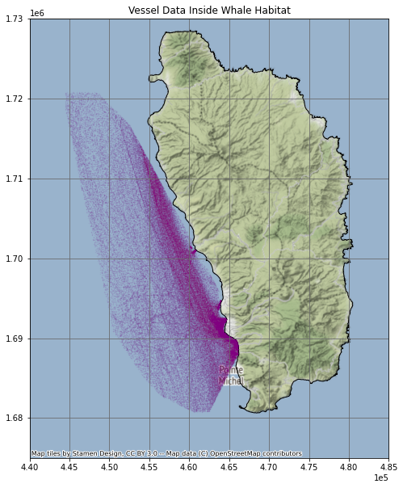
    


## Calculate Vessel Speeds

### Sort


```python
vessels_whale_sorted = vessels_whale.sort_values(['MMSI', 'TIMESTAMP'])
```

### Make Copy and Shift


```python
vessels_whale_shifted = vessels_whale_sorted.shift(periods = 1)
```

### Join Sorted With Shifted


```python
vw_sorted_shifted = vessels_whale_sorted.join(vessels_whale_shifted, lsuffix = "_original", rsuffix = "_copy")
```

### Match MMSI Numbers


```python
vw_matched = vw_sorted_shifted[vw_sorted_shifted['MMSI_original'] == vw_sorted_shifted['MMSI_copy']]
```

### Set Geometires


```python
vw_matched = vw_matched.set_geometry(col = vw_matched['geometry_original'], crs = projected_EPSG)
```

### Find the Distance (in meters - m)


```python
vw_matched['distance_m'] = vw_matched['geometry_original'].distance(vw_matched['geometry_copy']) 
```

### Find the Elapsed Time (seconds - s)


```python
vw_matched['time_s'] = vw_matched['TIMESTAMP_original'] - vw_matched['TIMESTAMP_copy']
```


```python
vw_matched['time_s'] = vw_matched['time_s'].dt.total_seconds() 
```

### Find the Speed (meters per seconds - ms)


```python
vw_matched['speed_ms'] = vw_matched['distance_m'] / vw_matched['time_s']
```


```python
vw_matched['10_kn_time'] = vw_matched['distance_m'] / ten_kn_in_ms
```


```python
vw_matched['time_diff'] = vw_matched['10_kn_time'].sub(vw_matched['time_s'])
```


```python
vw_matched = vw_matched[vw_matched['time_diff'] > 0]
```

### Plot Vessels travelling over 10 knots


```python
fig, ax = plt.subplots(figsize = (10, 10))
ax.grid(True, color = 'dimgray')
ax.set(xlim=(4.4e5, 4.85e5), ylim=(1.675e6, 1.73e6))
dominica_shp.plot(ax = ax, color='None', edgecolor = "k")
vw_matched.plot(ax = ax, markersize = .1, color = "purple", alpha = .25)
ax.set_title('Vessel Data Inside Whale Habitat', fontsize=12)
ax.ticklabel_format(scilimits =  [-5, 5])
ctx.add_basemap(ax, crs = projected_EPSG)
```


    
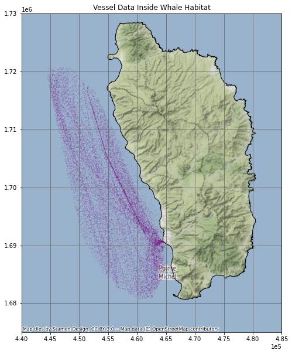
    


### View Summary Stats


```python
vw_matched[['distance_m', 'time_s', 'speed_ms']].describe()
```


<div>
<style scoped>
    .dataframe tbody tr th:only-of-type {
        vertical-align: middle;
    }

    .dataframe tbody tr th {
        vertical-align: top;
    }

    .dataframe thead th {
        text-align: right;
    }
</style>
<table border="1" class="dataframe">
  <thead>
    <tr style="text-align: right;">
      <th></th>
      <th>distance_m</th>
      <th>time_s</th>
      <th>speed_ms</th>
    </tr>
  </thead>
  <tbody>
    <tr>
      <th>count</th>
      <td>21282.000000</td>
      <td>21282.000000</td>
      <td>2.128200e+04</td>
    </tr>
    <tr>
      <th>mean</th>
      <td>1602.087151</td>
      <td>198.250728</td>
      <td>inf</td>
    </tr>
    <tr>
      <th>std</th>
      <td>1473.334485</td>
      <td>187.465984</td>
      <td>NaN</td>
    </tr>
    <tr>
      <th>min</th>
      <td>64.542545</td>
      <td>0.000000</td>
      <td>5.140343e+00</td>
    </tr>
    <tr>
      <th>25%</th>
      <td>838.258302</td>
      <td>120.000000</td>
      <td>5.949960e+00</td>
    </tr>
    <tr>
      <th>50%</th>
      <td>1150.938066</td>
      <td>141.000000</td>
      <td>6.826952e+00</td>
    </tr>
    <tr>
      <th>75%</th>
      <td>1805.137371</td>
      <td>181.000000</td>
      <td>8.696041e+00</td>
    </tr>
    <tr>
      <th>max</th>
      <td>28330.585863</td>
      <td>4085.000000</td>
      <td>inf</td>
    </tr>
  </tbody>
</table>
</div>


## Impact of a 10 knot Speed Reduction Zone
We calculated that ship vessel traffic would be slowed by 2 minutes per mile on average.  Over the course of the year, this equated to approximately 28 days of increased shipping time.


```python
num_days = vw_matched['time_diff'].sum() / 60 / 60 /24
```


```python
num_days
```


    27.9423247732646


```python
mean_time_lost = vw_matched['time_diff'].mean() / 60
```


```python
mean_time_lost
```


    1.8906563139508044


```python

```
