[](https://mybinder.org/v2/gh/mk-waves/mk-waves-tutorial/main) 

&uparrow;&uparrow;&uparrow;&uparrow;&uparrow;&uparrow;&uparrow;&uparrow;&uparrow;&uparrow;&uparrow;&uparrow;&uparrow;&uparrow;&uparrow;  
Click the binder icon above to begin a code along tutorial. A remote python session will launch in your browser with the tutorial
Be patient, sometimes it takes a while for the session to initialize the first few times. 

# HW3 Making Waves: CDIP Dataset Tutorial and Use Case Examples

### View and evaluating wave height and temperature from the Coastal Data Information Program

## EDS 220, Fall 2021

#### Authors

Cullen Molitor, UC Santa Barbara (cullen_molitor@bren.ucsb.edu)
https://cullen-molitor.github.io/  
Jake Eisaguirre, UC Santa Barbara (eisaguirre@bren.ucsb.edu)
https://jake-eisaguirre.github.io/  
Marie Rivers, UC Santa Barbara (mrivers@bren.ucsb.edu)
https://marierivers.github.io/

## Table of Contents

[1. Purpose](#purpose)

[2. Dataset Description](#data_description)

[3. Dataset Input/Output](#io)

[4. Metadata](#metadata)

[5. Visualize Data](#visualize)

[6. Use Case Examples](#usecases)

[7. References](#references)

<a id='purpose'></a> 

### Notebook Purpose

This notebook was created to provide an introduction to NetCDF4 files and data from the [Coastal Data Information Program (CDIP)](https://cdip.ucsd.edu/) at the [Scripps Institute of Oceanography (SIO)](https://scripps.ucsd.edu/). This tutorial is based on a [python API](https://cdip.ucsd.edu/m/documents/data_access.html) which loads netCDF files. We also provide methods for using sea surface temperature and swell height to compare correlations with El Nino/Southern Oscillation (ENSO) behavior at a specific location.

While these methods are applicable to other [CDIP wave buoy stations](https://cdip.ucsd.edu/m/deployment/station_view/), we chose the [Harvest Buoy (CDIP site)](http://cdip.ucsd.edu/themes/?d2=p9:s:71:st:1:m:mobile) to get information close to our local Santa Barbara, CA coast. The metadata is documented on the [CDIP informational site](https://cdip.ucsd.edu/m/documents/intro.html#).

We are also interested to see how the El Niño Southern Oscillation ([ENSO](https://www.climate.gov/news-features/blogs/enso/what-el-ni%C3%B1o%E2%80%93southern-oscillation-enso-nutshell)) effects our local waters in Santa Barbara California. To do this, we use the primary measurement of the strength of ENSO, the Oceanic Niño Index, which calculates a [monthly anomaly value](https://origin.cpc.ncep.noaa.gov/products/analysis_monitoring/ensostuff/ONI_change.shtml) for [region 3.4](https://www.ncdc.noaa.gov/teleconnections/enso/sst) in the equatorial pacific. Region 3.4 was chosen as it is the first zone to indicate ENSO and commonly used in ENSO research.   

<div>
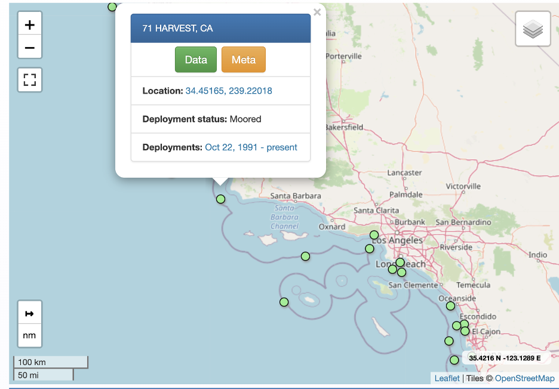  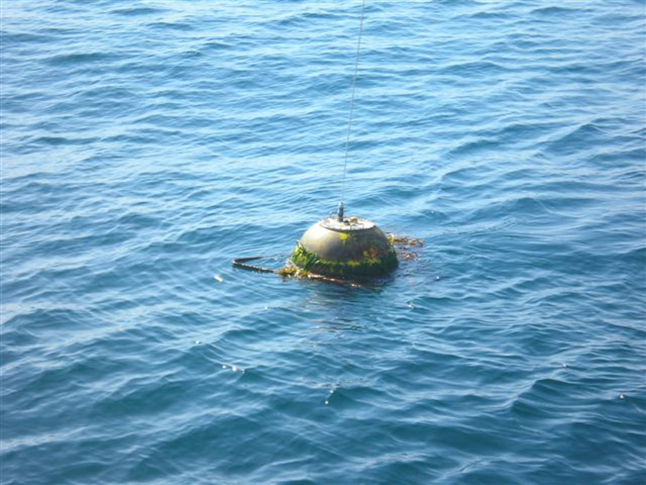
</div>

<a id='data_description'></a> 

### Buoy Dataset Description

**File format:** NetCDF  
**Data retrieval source:** CDIP portal and CDIP Python API
 
**Operator:** CDIP  
**Collaborators:** CleanSeas  
**Funding:** California Division of Boating and Waterways (CDBW) & US Army Corps of Engineer (USACE)

**Data Availability:** CDIP data and products are free available for public use  
**License:** These data may be redistributed and used without restriction

**Global coverage of stations:**  
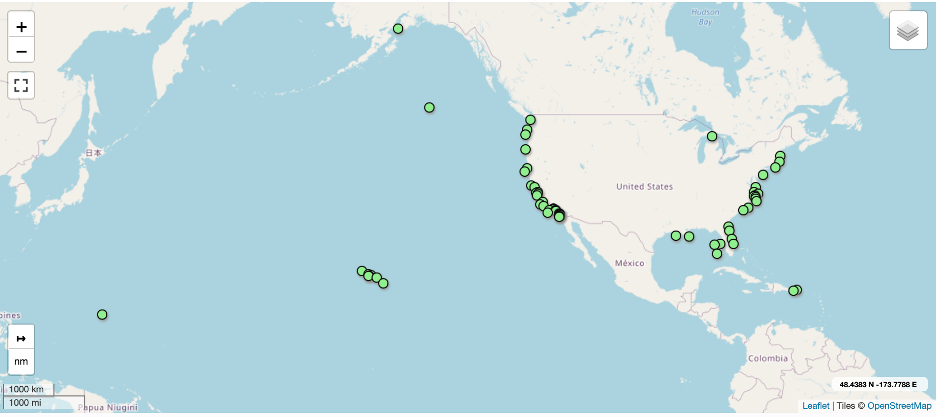

**Harvest buoy period of record:** October 1991 - present  

#### Measured wave parameters

Wave height is measured as the distance between the trough and the crest of a wave. Wave period measurements represent the time between two consecutive crests. Wave direction is the compass angle (0-360 degrees clockwise from true North) that the waves are coming from. Ocean waves never have just a single direction or period. Therefore, measurements of peak period (Tp) and peak direction (Dp) are reported. The peak period is the most common period between consecutive waves, and peak direction is the most common direction.

- Hs = wave height, 30-minute average of the ⅓ highest waves at a sensor
- Tp = peak period (most common period between consecutive waves)
- Dp = peak direction (most common direction)

CDIP documentation notes that statistical estimates of wave parameters have been developed by analyzing time-series measurements of a natural sea state. For example, significant wave height was designed to correspond to wave height estimates from experienced observer and is reported as the mean of the largest 1/3 (33%) of waves recorded during a sampling period. Ocean conditions constantly change and significant wave heights are statistical measures rather than measures corresponding to any specific wave. A given sampling period will have many waves smaller than Hs and some larger than Hs. Statistically, the largest wave in a 1,000 wave sample is likely to be ~1.8 times the reported significant wave height. 


<div>
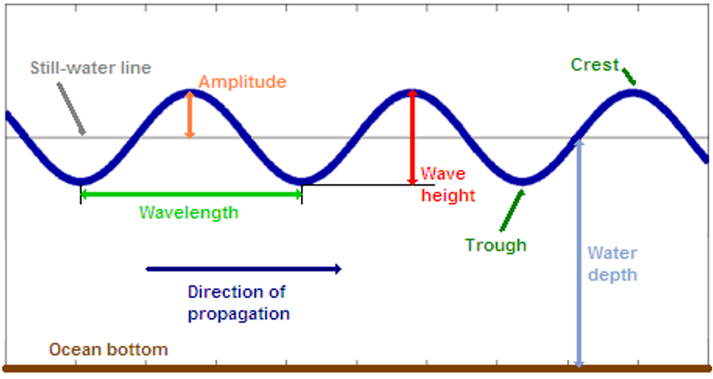
</div>

#### Equipment

CDIP uses Waverider (Mark III) directional buoys manufactured by Datawell that are equipped with accelerometers that measure wave height by recording the vertical acceleration of the buoy as it rises and falls with passing waves. Wave direction is recorded by horizontal accelerometers that measure north/south and east/west displacements. These buoys effectively measures waves with periods ranging from 1.6 to 30 seconds, with an error less than 3%. Temperature is measured by these buoys with a sensor is located approximately 18 inches below the watersurface. These buoys have a diameter of 0.9 meters. Available equipment documentation did not provide frequency of measurements.

#### Temporal notes

-  Wave calcs use ~30 minute data samples
- Time assigned to the data is start time
- All data collected is archived by UTC time

#### Data Quality

- high quality publicly released data excludes all records flagged by quality control procedures
- activity log documents deployments, transmission problems, maintenance issues, and battery/power failures

<a id='io'></a> 

### Buoy Dataset Input/Output 

#### Import required packages

<div>
<im src="Documents/UCSB_Environmental_Data_Science/EDS_220_Remote_Sensing_and_Environmental_Data/220_group_project/mk-waves-tutorial/images/havest.png"/>
</div>


```python
import netCDF4
import numpy as np
import matplotlib.pyplot as plt
import datetime
import time
import calendar
import pandas as pd
from matplotlib import gridspec
from matplotlib import cm
import matplotlib as mpl
```

#### Set parameters
- names of any directories where data are stored
- ranges of years over which data are valid
- any thresholds or latitude/longitude ranges to be used later (e.g. dimensions of NINO3.4 region, threshold SSTA values for El Nino, etc.)

The harvest buoy, CDIP station number of 071, was selected for our regional analysis of the Santa Barbara Coast.

[Link to other buoy stations](https://cdip.ucsd.edu/m/deployment/station_view/)


```python
# Type
stn = '071'
```

#### Read in the data

we use the `netCDF4` module to read in the archived buoy data.


```python
# CDIP Archived Dataset URL
data_url = 'http://thredds.cdip.ucsd.edu/thredds/dodsC/cdip/archive/' + stn + 'p1/' + stn + 'p1_historic.nc'
```


```python
data = netCDF4.Dataset(data_url)
```

<a id='metadata'></a> 

### Metadata

The CDIP metadata includes general information about the Harvest buoy such as current status, location, instrument description and most recent measurement values. The metadata also includes the availability of parameters for each month that the station has been in operation. The code below further explores metadata associated with this dataset

The `type` function in Python was used to display the file type of the data


```python
# return the file type
type(data)
```


    netCDF4._netCDF4.Dataset


The `summary` Python function was used to display summary text of the data


```python
# return a summary of the dataset
data.summary
```


    'Directional wave and sea surface temperature measurements collected in situ by Datawell Waverider buoys located near HARVEST, CA from 1991/10/22 to 2019/06/17. This dataset includes publicly-released data only, excluding all records flagged bad by quality control procedures. A total of 372110 wave samples were analyzed for this area, where the water depth is approximately 183 to 549 meters.'


The command `.variables.keys()` was used to return all variables included in the dataset.


```python
# return all variables included in the dataset
print(data.variables.keys())
```

    dict_keys(['sourceFilename', 'waveTime', 'waveTimeBounds', 'waveFlagPrimary', 'waveFlagSecondary', 'waveHs', 'waveTp', 'waveTa', 'waveDp', 'wavePeakPSD', 'waveTz', 'waveSourceIndex', 'waveFrequency', 'waveFrequencyBounds', 'waveFrequencyFlagPrimary', 'waveFrequencyFlagSecondary', 'waveBandwidth', 'sstTime', 'sstTimeBounds', 'sstFlagPrimary', 'sstFlagSecondary', 'sstSeaSurfaceTemperature', 'sstSourceIndex', 'sstReferenceTemp', 'gpsTime', 'gpsTimeBounds', 'gpsStatusFlags', 'gpsLatitude', 'gpsLongitude', 'gpsSourceIndex', 'dwrTime', 'dwrTimeBounds', 'dwrSourceIndex', 'dwrBatteryLevel', 'dwrZAccelerometerOffset', 'dwrXAccelerometerOffset', 'dwrYAccelerometerOffset', 'dwrOrientation', 'dwrInclination', 'dwrBatteryWeeksOfLife', 'metaDeployLatitude', 'metaDeployLongitude', 'metaWaterDepth', 'metaDeclination', 'metaStationName', 'metaStationLatitude', 'metaStationLongitude', 'metaPlatform', 'metaInstrumentation', 'metaGridMapping', 'waveEnergyDensity', 'waveMeanDirection', 'waveA1Value', 'waveB1Value', 'waveA2Value', 'waveB2Value', 'waveCheckFactor', 'waveSpread', 'waveM2Value', 'waveN2Value'])
    

The Harvest buoy collects data in the following categories:

- Significant Wave Height  
- Swell Height 
- Swell Period 
- Swell Direction 
- Wind Wave Height 
- Wind Wave Period 
- Wind Wave Direction 
- Wave Steepness 
- Average Wave Period 
- Water Temperature

For this tutorial we are interested in:

- Significant Wave Height (`waveHs`)
- Sea Surface Temperature (`sstSeaSurfaceTemperature`)

By using a print statement with the dataframe name and variable in brackets, you can view the long name, units, minimum values, and maximum values of a variable


```python
# learn more about a variable including long name, units, valid min/max values
print(data['sstSeaSurfaceTemperature'])
```

    <class 'netCDF4._netCDF4.Variable'>
    float32 sstSeaSurfaceTemperature(sstTime)
        long_name: sea surface temperature
        units: Celsius
        _FillValue: -999.99
        standard_name: sea_surface_temperature
        coordinates: metaStationLatitude metaStationLongitude
        grid_mapping: metaGridMapping
        valid_min: -5.0
        valid_max: 46.15
        ancillary_variables: sstFlagPrimary sstFlagSecondary
        ncei_name: SEA SURFACE TEMPERATURE
        cell_methods: sstTime: point
    unlimited dimensions: 
    current shape = (372015,)
    filling off
    


```python
# Other Variables
# data.variables
# Hs = data.variables['waveHs']
# Tp = data.variables['waveTp']
# Dp = data.variables['waveDp'] 
```

#### Clean data

Thanks to the data processing methods used by CDIP, the downloaded datafiles did not require much actual cleaning. Since the sea surface temperature and wave height variables had different timestamps associated with each measurements we pulled out these variables for use in creating new dataframes that were used as an intermediate step in our overall analysis

[Example code found here](http://cdip.ucsd.edu/themes/?zoom=auto&tz=UTC&ll_fmt=dm&numcolorbands=100&palette=cdip_classic&high=4.572&r=7&un=1&pb=1&d2=p70&u2=s:071:st:1:v:product_descriptions)


```python
# Get SST timestamp variable 
sst_time_var = data.variables['sstTime']

# Get SST variable 
sst = data.variables['sstSeaSurfaceTemperature'][:]

# Get wave height timestamp variable
wave_time_var = data.variables['waveTime']

# Get wave height variable 
wave = data.variables['waveHs'][:]
```

We used the cftime Python library for decoding time units and variable values in a netCDF file conforming to the Climate and Forecasting (CF) netCDF conventions.

[cftime documentation](https://unidata.github.io/cftime/)

First we created dataframes for the sea surface temperature `sst_df` and wave height `wave_df` data. We then aggregated this data by month and joined the dataframes to create one dataframe of buoy variables.


```python
# Use num2date on sst_time_var
sst_time = netCDF4.num2date(sst_time_var[:], sst_time_var.units, only_use_cftime_datetimes=False)
```


```python
# Make an empty pandas dataframe
sst_df = pd.DataFrame()

# Fill it with SST and the date time it was collected
sst_df['sst'] = sst
sst_df['date_time'] = sst_time
```

The code below creates columns for the date, month, and year of each observation timestamp. These values will later be used to calculate monthly means.


```python
# Make date_time column a pandas date_time
sst_df['date_time'] = pd.to_datetime(sst_df['date_time']) 

# Pull out date from datetime
sst_df['date'] = sst_df['date_time'].dt.date

# Pull out month from datetime
sst_df['month'] = sst_df['date_time'].dt.month

# Pull out year from datetime
sst_df['year'] = sst_df['date_time'].dt.year
```


```python
# Use num2date on wave_time_var
wave_time = netCDF4.num2date(wave_time_var[:], wave_time_var.units, only_use_cftime_datetimes=False)
```


```python
# Make an empty pandas dataframe
wave_df = pd.DataFrame()

# Fill it with SST and the date time it was collected
wave_df['wave'] = wave
wave_df['date_time'] = wave_time
```


```python
# Make date_time column a pandas date_time
wave_df['date_time'] = pd.to_datetime(wave_df['date_time']) 

# Pull out date from datetime
wave_df['date'] = wave_df['date_time'].dt.date

# Pull out month from datetime
wave_df['month'] = wave_df['date_time'].dt.month

# Pull out year from datetime
wave_df['year'] = wave_df['date_time'].dt.year
```

The next two code chunks let you view the newly created sea surface temperature and wave height dataframes


```python
# Inspect data
sst_df.head()
```


<div>
<style scoped>
    .dataframe tbody tr th:only-of-type {
        vertical-align: middle;
    }

    .dataframe tbody tr th {
        vertical-align: top;
    }

    .dataframe thead th {
        text-align: right;
    }
</style>
<table border="1" class="dataframe">
  <thead>
    <tr style="text-align: right;">
      <th></th>
      <th>sst</th>
      <th>date_time</th>
      <th>date</th>
      <th>month</th>
      <th>year</th>
    </tr>
  </thead>
  <tbody>
    <tr>
      <th>0</th>
      <td>16.00</td>
      <td>1991-10-22 08:21:00</td>
      <td>1991-10-22</td>
      <td>10</td>
      <td>1991</td>
    </tr>
    <tr>
      <th>1</th>
      <td>16.00</td>
      <td>1991-10-22 08:51:00</td>
      <td>1991-10-22</td>
      <td>10</td>
      <td>1991</td>
    </tr>
    <tr>
      <th>2</th>
      <td>15.90</td>
      <td>1991-10-22 09:21:00</td>
      <td>1991-10-22</td>
      <td>10</td>
      <td>1991</td>
    </tr>
    <tr>
      <th>3</th>
      <td>15.90</td>
      <td>1991-10-22 09:51:00</td>
      <td>1991-10-22</td>
      <td>10</td>
      <td>1991</td>
    </tr>
    <tr>
      <th>4</th>
      <td>15.85</td>
      <td>1991-10-22 10:21:00</td>
      <td>1991-10-22</td>
      <td>10</td>
      <td>1991</td>
    </tr>
  </tbody>
</table>
</div>


```python
wave_df.head()
```


<div>
<style scoped>
    .dataframe tbody tr th:only-of-type {
        vertical-align: middle;
    }

    .dataframe tbody tr th {
        vertical-align: top;
    }

    .dataframe thead th {
        text-align: right;
    }
</style>
<table border="1" class="dataframe">
  <thead>
    <tr style="text-align: right;">
      <th></th>
      <th>wave</th>
      <th>date_time</th>
      <th>date</th>
      <th>month</th>
      <th>year</th>
    </tr>
  </thead>
  <tbody>
    <tr>
      <th>0</th>
      <td>1.50</td>
      <td>1991-10-22 07:52:00</td>
      <td>1991-10-22</td>
      <td>10</td>
      <td>1991</td>
    </tr>
    <tr>
      <th>1</th>
      <td>1.48</td>
      <td>1991-10-22 08:22:00</td>
      <td>1991-10-22</td>
      <td>10</td>
      <td>1991</td>
    </tr>
    <tr>
      <th>2</th>
      <td>1.54</td>
      <td>1991-10-22 08:52:00</td>
      <td>1991-10-22</td>
      <td>10</td>
      <td>1991</td>
    </tr>
    <tr>
      <th>3</th>
      <td>1.56</td>
      <td>1991-10-22 09:22:00</td>
      <td>1991-10-22</td>
      <td>10</td>
      <td>1991</td>
    </tr>
    <tr>
      <th>4</th>
      <td>1.59</td>
      <td>1991-10-22 09:52:00</td>
      <td>1991-10-22</td>
      <td>10</td>
      <td>1991</td>
    </tr>
  </tbody>
</table>
</div>


### ENSO Dataset

El Nino/Southern Oscillation (ENSO) data was obtained from the National Oceanic and Atmospheric Administration (NOAA) Climate Prediction Center. The code below goes through the steps to download and visualize this data then manipulate it to use in conjunction with the buoy dataset. We used Nino Region 3.4 for our analysis.

#### Read in [ENSO](https://www.cpc.ncep.noaa.gov/data/indices/ersst5.nino.mth.91-20.ascii) data

[ERSST5](https://psl.noaa.gov/data/gridded/data.noaa.ersst.v5.html) Extended Reconstructed Sea Surface Temperature (SST) V5  
[Nino Regions](https://www.ncdc.noaa.gov/teleconnections/enso/sst)

<div>
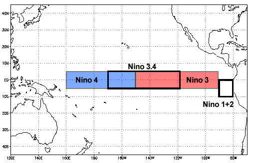
</div>


We use `sep = '\s{2,}'` because the data linked above is seperated by two or more spaces, not a comma or other typical delimiter. 


```python
path = "https://www.cpc.ncep.noaa.gov/data/indices/ersst5.nino.mth.91-20.ascii"
enso = pd.read_csv(path, sep = '\s{2,}', engine = 'python')
enso.head()
```


<div>
<style scoped>
    .dataframe tbody tr th:only-of-type {
        vertical-align: middle;
    }

    .dataframe tbody tr th {
        vertical-align: top;
    }

    .dataframe thead th {
        text-align: right;
    }
</style>
<table border="1" class="dataframe">
  <thead>
    <tr style="text-align: right;">
      <th></th>
      <th>YR</th>
      <th>MON</th>
      <th>NINO1+2</th>
      <th>ANOM</th>
      <th>NINO3</th>
      <th>ANOM.1</th>
      <th>NINO4</th>
      <th>ANOM.2</th>
      <th>NINO3.4</th>
      <th>ANOM.3</th>
    </tr>
  </thead>
  <tbody>
    <tr>
      <th>0</th>
      <td>1950</td>
      <td>1</td>
      <td>23.01</td>
      <td>-1.55</td>
      <td>23.56</td>
      <td>-2.10</td>
      <td>26.94</td>
      <td>-1.38</td>
      <td>24.55</td>
      <td>-1.99</td>
    </tr>
    <tr>
      <th>1</th>
      <td>1950</td>
      <td>2</td>
      <td>24.32</td>
      <td>-1.78</td>
      <td>24.89</td>
      <td>-1.52</td>
      <td>26.67</td>
      <td>-1.53</td>
      <td>25.06</td>
      <td>-1.69</td>
    </tr>
    <tr>
      <th>2</th>
      <td>1950</td>
      <td>3</td>
      <td>25.11</td>
      <td>-1.38</td>
      <td>26.36</td>
      <td>-0.84</td>
      <td>26.52</td>
      <td>-1.80</td>
      <td>25.87</td>
      <td>-1.42</td>
    </tr>
    <tr>
      <th>3</th>
      <td>1950</td>
      <td>4</td>
      <td>23.63</td>
      <td>-1.90</td>
      <td>26.44</td>
      <td>-1.14</td>
      <td>26.90</td>
      <td>-1.73</td>
      <td>26.28</td>
      <td>-1.54</td>
    </tr>
    <tr>
      <th>4</th>
      <td>1950</td>
      <td>5</td>
      <td>22.68</td>
      <td>-1.74</td>
      <td>25.69</td>
      <td>-1.57</td>
      <td>27.73</td>
      <td>-1.18</td>
      <td>26.18</td>
      <td>-1.75</td>
    </tr>
  </tbody>
</table>
</div>


```python
# drop unused columns from ENSO data
enso = enso.drop(enso.columns[[2, 3, 4, 5, 6, 7, 8]], axis=1)

# rename columns
enso = enso.rename(columns={"YR":"year", "MON":"month", "ANOM.3": "enso_anom"})
enso.head()
```


<div>
<style scoped>
    .dataframe tbody tr th:only-of-type {
        vertical-align: middle;
    }

    .dataframe tbody tr th {
        vertical-align: top;
    }

    .dataframe thead th {
        text-align: right;
    }
</style>
<table border="1" class="dataframe">
  <thead>
    <tr style="text-align: right;">
      <th></th>
      <th>year</th>
      <th>month</th>
      <th>enso_anom</th>
    </tr>
  </thead>
  <tbody>
    <tr>
      <th>0</th>
      <td>1950</td>
      <td>1</td>
      <td>-1.99</td>
    </tr>
    <tr>
      <th>1</th>
      <td>1950</td>
      <td>2</td>
      <td>-1.69</td>
    </tr>
    <tr>
      <th>2</th>
      <td>1950</td>
      <td>3</td>
      <td>-1.42</td>
    </tr>
    <tr>
      <th>3</th>
      <td>1950</td>
      <td>4</td>
      <td>-1.54</td>
    </tr>
    <tr>
      <th>4</th>
      <td>1950</td>
      <td>5</td>
      <td>-1.75</td>
    </tr>
  </tbody>
</table>
</div>


<a id='visualize'></a> 

### Visualize data

#### Harvet buoy visualization

We started by visualizing the full dataset to inform our further analysis. Based on the data gaps shown in the plot, we decided to begin our analysis at 1997.


```python
# Plot here to see what the data looks like
f, (pHs, pSst) = plt.subplots(2, 1, sharex=True, figsize=(15,10)) 
pSst.plot(sst_df.date, sst_df.sst, linewidth = 0.5)
pHs.plot(wave_df.date, wave_df.wave, linewidth = 0.5)
plt.title("Harvest Buoy", fontsize=30, y = 2.3)
pHs.set_ylabel('Wave Height, m', fontsize=18)
pSst.set_ylabel('SST, C', fontsize=18)
```


    Text(0, 0.5, 'SST, C')


    
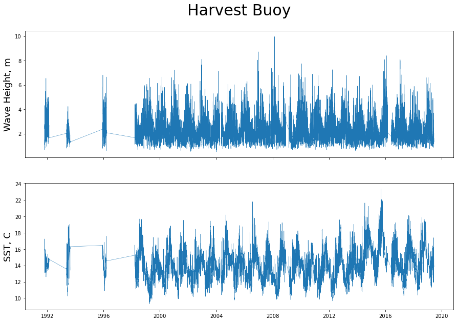
    


#### ENSO anomaly visualization

The below plot shows the Oceanic Nino Index anaomaly vvalues from 1950 to the most current available data. The area under/over the curve to the x-axis is colored by the intensity of the anomaly. Anomaly values over 0.5°C for 5 consecutive 3 month seasonal averages are considered to be El Niño. Anomaly values under -0.5°C for 5 consecutive 3 month seasonal averages are considered to be La Niña.  

Next we `assign()` an arbitrary day value of 1 in order to make a date with `pd.to_datetime()` function


```python
enso = enso.assign(day = 1)
enso['date'] = pd.to_datetime(enso[['year', 'month', 'day']])
```


```python
# Choose color gradient here: https://matplotlib.org/stable/tutorials/colors/colormaps.html 

colourmap = cm.get_cmap('magma')

xx = enso.date
yy =  enso.enso_anom

plt.figure(figsize = (15, 5))
plt.plot(xx,yy, color = 'none')

normalize = mpl.colors.Normalize(vmin=yy.min(), vmax=yy.max())
npts = len(enso)
for i in range(npts - 1):
    plt.fill_between([xx[i], xx[i+1]],
                     [yy[i], yy[i+1]],
                     color=colourmap(normalize(yy[i]))
                     ,alpha=0.6)
plt.show()
```


    
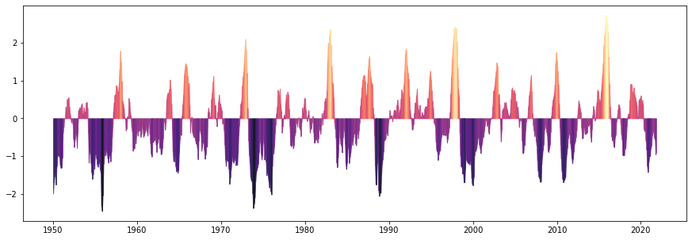
    


<a id='usecases'></a> 

### Use Cases Examples

**Observational Data vs Modeled Data**

The CDIP buoy network is a valuable resource for marine scientists, coastal managers, and mariners. The **historic data** (observational) is archived and is of great use for understanding past patterns and provides context for understanding the oceanographic conditions of our local ocean. **Real time data** (observational) gives an better idea of what to expect as wave energy moves past the buoy and towards our shoreline. It is also incredibly useful for mariners navigating these sometimes harsh and volatile waters. Forecasted data (modeled) is perhaps the most practical use case for mariners, as they not only need to know the current conditions but they need to know how those conditions are changing in order to navigate safely. 

CDIP provide what they call ['nowcasted' data and 'forecasted' data](https://cdip.ucsd.edu/m/documents/models.html#about-the-cdip-wave-forecast-model). 
- Nowcasted provides insight at a higher resolution for the upcoming 6-hour period. These predictions tend to be more accurate and are generally fairly trustworthy. 
- Forecasted data provide a look further into the future, but with a greater amount of uncertainty  

**Our interest**

We are interested in investigating the effect of El Niño on our local oceanographic conditions. We used linear regression models to plot and compare equatorial sea surface temperature anomalies with local Santa Barbara temperature and wave height. Typically temperature anomalies are calculated from a 30 year base period. Since we only had ~20 years of consistent data, we calculated monthly means since 1997 and used these as base values from which to compare monthly means for each year. The results of this analysis are useful to scientist, marine managers, marine conservation groups and coastal communities.

**Other General Use Cases**

- Modeling coastal erosion 
- Investigating storm frequency and intensity over time
- Investigating changes in SST over time
- Detecting upwelling events

The code chunks below take the sea surface temperature and wave height dataframes created from the buoy data and group values by month and year so that monthly averages can be calculated. The two datasets are then grouped into a single buoy dataframe, `buoy_df`.


```python
# Filter data to be greater than 1997 due to missing values before that time
sst_df = sst_df[sst_df['year'] > 1997]

wave_df = wave_df[wave_df['year'] > 1997]
```


```python
# Group by date and summarise with mean SST and Wave Height
sst_monthly = sst_df.groupby(['month', 'year']).agg({'sst': 'mean'})

wave_monthly = wave_df.groupby(['month', 'year']).agg({'wave': 'mean'})
```


```python
# Inspect Data
print(sst_monthly.head())
print(wave_monthly.head())
```

                      sst
    month year           
    1     1999  13.194914
          2000  13.023686
          2001  13.454234
          2002  12.896236
          2003  14.313378
                    wave
    month year          
    1     1999  2.467315
          2000  2.126410
          2001  2.971848
          2002  2.609128
          2003  2.432630
    


```python
# join monthly sst and wave data into a buoy dataframe
buoy_df = sst_monthly.join(wave_monthly)
buoy_df.head()
```


<div>
<style scoped>
    .dataframe tbody tr th:only-of-type {
        vertical-align: middle;
    }

    .dataframe tbody tr th {
        vertical-align: top;
    }

    .dataframe thead th {
        text-align: right;
    }
</style>
<table border="1" class="dataframe">
  <thead>
    <tr style="text-align: right;">
      <th></th>
      <th></th>
      <th>sst</th>
      <th>wave</th>
    </tr>
    <tr>
      <th>month</th>
      <th>year</th>
      <th></th>
      <th></th>
    </tr>
  </thead>
  <tbody>
    <tr>
      <th rowspan="5" valign="top">1</th>
      <th>1999</th>
      <td>13.194914</td>
      <td>2.467315</td>
    </tr>
    <tr>
      <th>2000</th>
      <td>13.023686</td>
      <td>2.126410</td>
    </tr>
    <tr>
      <th>2001</th>
      <td>13.454234</td>
      <td>2.971848</td>
    </tr>
    <tr>
      <th>2002</th>
      <td>12.896236</td>
      <td>2.609128</td>
    </tr>
    <tr>
      <th>2003</th>
      <td>14.313378</td>
      <td>2.432630</td>
    </tr>
  </tbody>
</table>
</div>


Next we used `reset_index` to ungroup the buoy data


```python
buoy_df = buoy_df.reset_index()
buoy_df.head()
```


<div>
<style scoped>
    .dataframe tbody tr th:only-of-type {
        vertical-align: middle;
    }

    .dataframe tbody tr th {
        vertical-align: top;
    }

    .dataframe thead th {
        text-align: right;
    }
</style>
<table border="1" class="dataframe">
  <thead>
    <tr style="text-align: right;">
      <th></th>
      <th>month</th>
      <th>year</th>
      <th>sst</th>
      <th>wave</th>
    </tr>
  </thead>
  <tbody>
    <tr>
      <th>0</th>
      <td>1</td>
      <td>1999</td>
      <td>13.194914</td>
      <td>2.467315</td>
    </tr>
    <tr>
      <th>1</th>
      <td>1</td>
      <td>2000</td>
      <td>13.023686</td>
      <td>2.126410</td>
    </tr>
    <tr>
      <th>2</th>
      <td>1</td>
      <td>2001</td>
      <td>13.454234</td>
      <td>2.971848</td>
    </tr>
    <tr>
      <th>3</th>
      <td>1</td>
      <td>2002</td>
      <td>12.896236</td>
      <td>2.609128</td>
    </tr>
    <tr>
      <th>4</th>
      <td>1</td>
      <td>2003</td>
      <td>14.313378</td>
      <td>2.432630</td>
    </tr>
  </tbody>
</table>
</div>


Here we calculate anomalies for buoy sea surface temperature and wave height values.


```python
# calculate the anomalies
buoy_df = buoy_df.groupby(['month', 'year']).agg({'sst': 'mean', 'wave': 'mean'}) - \
    buoy_df.groupby(['month']).agg({'sst': 'mean', 'wave': 'mean'}) 
buoy_df.head()

# since this line of code was so long, use used a `\` to break up the line. You can also split up lines at commas
```


<div>
<style scoped>
    .dataframe tbody tr th:only-of-type {
        vertical-align: middle;
    }

    .dataframe tbody tr th {
        vertical-align: top;
    }

    .dataframe thead th {
        text-align: right;
    }
</style>
<table border="1" class="dataframe">
  <thead>
    <tr style="text-align: right;">
      <th></th>
      <th></th>
      <th>sst</th>
      <th>wave</th>
    </tr>
    <tr>
      <th>month</th>
      <th>year</th>
      <th></th>
      <th></th>
    </tr>
  </thead>
  <tbody>
    <tr>
      <th rowspan="5" valign="top">1</th>
      <th>1999</th>
      <td>-0.458099</td>
      <td>-0.088380</td>
    </tr>
    <tr>
      <th>2000</th>
      <td>-0.629327</td>
      <td>-0.429286</td>
    </tr>
    <tr>
      <th>2001</th>
      <td>-0.198779</td>
      <td>0.416153</td>
    </tr>
    <tr>
      <th>2002</th>
      <td>-0.756777</td>
      <td>0.053433</td>
    </tr>
    <tr>
      <th>2003</th>
      <td>0.660365</td>
      <td>-0.123065</td>
    </tr>
  </tbody>
</table>
</div>


Note: You need to reset the index each time you group the data


```python
buoy_df = buoy_df.reset_index()
buoy_df.head()
```


<div>
<style scoped>
    .dataframe tbody tr th:only-of-type {
        vertical-align: middle;
    }

    .dataframe tbody tr th {
        vertical-align: top;
    }

    .dataframe thead th {
        text-align: right;
    }
</style>
<table border="1" class="dataframe">
  <thead>
    <tr style="text-align: right;">
      <th></th>
      <th>month</th>
      <th>year</th>
      <th>sst</th>
      <th>wave</th>
    </tr>
  </thead>
  <tbody>
    <tr>
      <th>0</th>
      <td>1</td>
      <td>1999</td>
      <td>-0.458099</td>
      <td>-0.088380</td>
    </tr>
    <tr>
      <th>1</th>
      <td>1</td>
      <td>2000</td>
      <td>-0.629327</td>
      <td>-0.429286</td>
    </tr>
    <tr>
      <th>2</th>
      <td>1</td>
      <td>2001</td>
      <td>-0.198779</td>
      <td>0.416153</td>
    </tr>
    <tr>
      <th>3</th>
      <td>1</td>
      <td>2002</td>
      <td>-0.756777</td>
      <td>0.053433</td>
    </tr>
    <tr>
      <th>4</th>
      <td>1</td>
      <td>2003</td>
      <td>0.660365</td>
      <td>-0.123065</td>
    </tr>
  </tbody>
</table>
</div>


```python
# rename columns
buoy_df = buoy_df.rename(columns = {'sst':'buoy_sst_anom', 'wave':'buoy_wave_anom'})

# Assign arbitrary day value
buoy_df = buoy_df.assign(day = 1) 

# set datetime 
buoy_df['date'] = pd.to_datetime(buoy_df[['year', 'month', 'day']])

# sort values
buoy_df = buoy_df.sort_values(by=['date'])

# set the index for plotting
buoy_df = buoy_df.set_index('date')
```


```python
# Inspect
buoy_df.head()
```


<div>
<style scoped>
    .dataframe tbody tr th:only-of-type {
        vertical-align: middle;
    }

    .dataframe tbody tr th {
        vertical-align: top;
    }

    .dataframe thead th {
        text-align: right;
    }
</style>
<table border="1" class="dataframe">
  <thead>
    <tr style="text-align: right;">
      <th></th>
      <th>month</th>
      <th>year</th>
      <th>buoy_sst_anom</th>
      <th>buoy_wave_anom</th>
      <th>day</th>
    </tr>
    <tr>
      <th>date</th>
      <th></th>
      <th></th>
      <th></th>
      <th></th>
      <th></th>
    </tr>
  </thead>
  <tbody>
    <tr>
      <th>1998-03-01</th>
      <td>3</td>
      <td>1998</td>
      <td>1.834283</td>
      <td>0.105816</td>
      <td>1</td>
    </tr>
    <tr>
      <th>1998-04-01</th>
      <td>4</td>
      <td>1998</td>
      <td>0.914924</td>
      <td>-0.130027</td>
      <td>1</td>
    </tr>
    <tr>
      <th>1998-05-01</th>
      <td>5</td>
      <td>1998</td>
      <td>0.674051</td>
      <td>-0.090042</td>
      <td>1</td>
    </tr>
    <tr>
      <th>1998-06-01</th>
      <td>6</td>
      <td>1998</td>
      <td>0.614153</td>
      <td>-0.300137</td>
      <td>1</td>
    </tr>
    <tr>
      <th>1998-07-01</th>
      <td>7</td>
      <td>1998</td>
      <td>1.214789</td>
      <td>0.132242</td>
      <td>1</td>
    </tr>
  </tbody>
</table>
</div>


**Joining enso and buoy data:** Here we join the buoy dataframe and ENSO dataframe by `date` and create a basic plot of each anomaly.


```python
buoy_df = buoy_df.drop(["month", "year", "day"], axis=1).reset_index()
enso = enso.drop(["year", "month", "day"], axis = 1)
```


```python
anom_df = buoy_df.set_index('date').join(enso.set_index('date')).reset_index()
```


```python
# Plot sst and wave height anomaly from buoy along with ENSO sst anomaly
f, (bwa, bsa, esa ) = plt.subplots(3, 1, sharex=True, figsize=(15,10))

bwa.plot(anom_df.date, anom_df.buoy_wave_anom)
bwa.fill_between(anom_df.date, anom_df.buoy_wave_anom, 0, alpha=0.30)
bwa.axhline(0,color='red')
bwa.set_ylabel('Buoy Wave Height Anomaly')

bsa.plot(anom_df.date, anom_df.buoy_sst_anom)
bsa.fill_between(anom_df.date, anom_df.buoy_sst_anom,  0, alpha=0.30)
bsa.axhline(0,color='red')
bsa.set_ylabel('Buoy SST Anomaly')

esa.plot(anom_df.date, anom_df.enso_anom)
esa.fill_between(anom_df.date, anom_df.enso_anom,  0, alpha=0.30)
esa.axhline(0,color='red')
esa.set_ylabel('ENSO Anomaly')
```


    Text(0, 0.5, 'ENSO Anomaly')


    
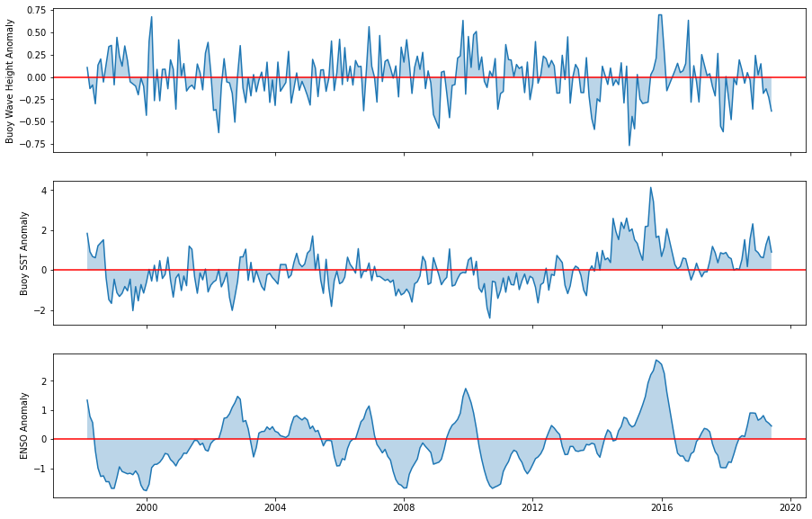
    


#### Model

We used the `statsmodels` package to develop linear regression models of the anomaly dataframes created in the sections above. We modeled anomalies for buoy sea surface temperature vs. ENSO sea surface temperature, buoy wave height vs. ENSO sea surface temperature, and buoy wave height vs. buoy sea surface temperature.


```python
import statsmodels.api as sm
```

**Buoy sea surface tempurature anomaly vs. ENSO sea surface temperature anomaly**


```python
# Simple linear model: buoy sst anomaly vs enso sst anomaly
model = sm.OLS(anom_df.buoy_sst_anom, anom_df.enso_anom)

# Model results
results = model.fit()

# Model summary
print(results.summary())
```

                                     OLS Regression Results                                
    =======================================================================================
    Dep. Variable:          buoy_sst_anom   R-squared (uncentered):                   0.282
    Model:                            OLS   Adj. R-squared (uncentered):              0.279
    Method:                 Least Squares   F-statistic:                              98.58
    Date:                Tue, 07 Dec 2021   Prob (F-statistic):                    8.24e-20
    Time:                        18:09:44   Log-Likelihood:                         -312.83
    No. Observations:                 252   AIC:                                      627.7
    Df Residuals:                     251   BIC:                                      631.2
    Df Model:                           1                                                  
    Covariance Type:            nonrobust                                                  
    ==============================================================================
                     coef    std err          t      P>|t|      [0.025      0.975]
    ------------------------------------------------------------------------------
    enso_anom      0.5964      0.060      9.929      0.000       0.478       0.715
    ==============================================================================
    Omnibus:                       11.182   Durbin-Watson:                   0.808
    Prob(Omnibus):                  0.004   Jarque-Bera (JB):               12.718
    Skew:                           0.402   Prob(JB):                      0.00173
    Kurtosis:                       3.751   Cond. No.                         1.00
    ==============================================================================
    
    Notes:
    [1] R² is computed without centering (uncentered) since the model does not contain a constant.
    [2] Standard Errors assume that the covariance matrix of the errors is correctly specified.
    

**Buoy wave height anomaly vs. ENSO sea surface temperature anomaly**


```python
# Simple linear model: buoy wave anomaly vs enso sst anomaly
model = sm.OLS(anom_df.buoy_wave_anom, anom_df.enso_anom)

# Model results
results = model.fit()

# Model summary
print(results.summary())
```

                                     OLS Regression Results                                
    =======================================================================================
    Dep. Variable:         buoy_wave_anom   R-squared (uncentered):                   0.000
    Model:                            OLS   Adj. R-squared (uncentered):             -0.004
    Method:                 Least Squares   F-statistic:                           0.006389
    Date:                Tue, 07 Dec 2021   Prob (F-statistic):                       0.936
    Time:                        18:09:44   Log-Likelihood:                         -11.128
    No. Observations:                 252   AIC:                                      24.26
    Df Residuals:                     251   BIC:                                      27.79
    Df Model:                           1                                                  
    Covariance Type:            nonrobust                                                  
    ==============================================================================
                     coef    std err          t      P>|t|      [0.025      0.975]
    ------------------------------------------------------------------------------
    enso_anom      0.0015      0.018      0.080      0.936      -0.034       0.037
    ==============================================================================
    Omnibus:                        1.416   Durbin-Watson:                   1.619
    Prob(Omnibus):                  0.493   Jarque-Bera (JB):                1.162
    Skew:                           0.011   Prob(JB):                        0.559
    Kurtosis:                       3.332   Cond. No.                         1.00
    ==============================================================================
    
    Notes:
    [1] R² is computed without centering (uncentered) since the model does not contain a constant.
    [2] Standard Errors assume that the covariance matrix of the errors is correctly specified.
    

**Buoy wave height anomaly vs. buoy sea surface temperature anomaly**


```python
# Simple linear model: buoy wave anomaly vs buoy sst anomaly
model = sm.OLS(anom_df.buoy_wave_anom, anom_df.buoy_sst_anom)

# Model results
results = model.fit()

# Model summary
print(results.summary())
```

                                     OLS Regression Results                                
    =======================================================================================
    Dep. Variable:         buoy_wave_anom   R-squared (uncentered):                   0.035
    Model:                            OLS   Adj. R-squared (uncentered):              0.031
    Method:                 Least Squares   F-statistic:                              9.167
    Date:                Tue, 07 Dec 2021   Prob (F-statistic):                     0.00272
    Time:                        18:09:44   Log-Likelihood:                         -6.6118
    No. Observations:                 252   AIC:                                      15.22
    Df Residuals:                     251   BIC:                                      18.75
    Df Model:                           1                                                  
    Covariance Type:            nonrobust                                                  
    =================================================================================
                        coef    std err          t      P>|t|      [0.025      0.975]
    ---------------------------------------------------------------------------------
    buoy_sst_anom    -0.0480      0.016     -3.028      0.003      -0.079      -0.017
    ==============================================================================
    Omnibus:                        2.296   Durbin-Watson:                   1.645
    Prob(Omnibus):                  0.317   Jarque-Bera (JB):                2.133
    Skew:                           0.093   Prob(JB):                        0.344
    Kurtosis:                       3.410   Cond. No.                         1.00
    ==============================================================================
    
    Notes:
    [1] R² is computed without centering (uncentered) since the model does not contain a constant.
    [2] Standard Errors assume that the covariance matrix of the errors is correctly specified.
    

**Visualize model results**


```python
m, b = np.polyfit(anom_df.enso_anom, anom_df.buoy_sst_anom, 1)
plt.figure(figsize = (10, 5))
plt.scatter(anom_df.enso_anom, anom_df.buoy_sst_anom)
plt.plot(anom_df.enso_anom, m * anom_df.enso_anom + b, color = 'red')
plt.title('Buoy SST Anomaly ~ ENSO SST Anomaly')
plt.ylabel('Buoy SST Anomaly')
plt.xlabel('ENSO SST Anomaly')
```


    Text(0.5, 0, 'ENSO SST Anomaly')


    
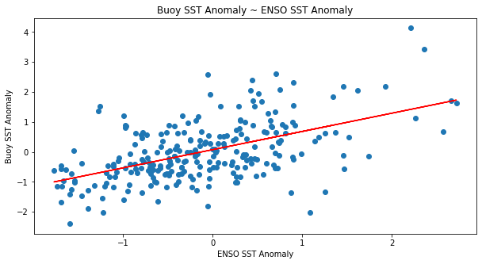
    


```python
m, b = np.polyfit(anom_df.enso_anom, anom_df.buoy_wave_anom, 1)
plt.figure(figsize = (10, 5))
plt.scatter(anom_df.enso_anom, anom_df.buoy_wave_anom)
plt.plot(anom_df.enso_anom, m * anom_df.enso_anom + b, color = 'red')
plt.title('Buoy Wave Anomaly ~ ENSO SST Anomaly')
plt.ylabel('Buoy Wave Anomaly')
plt.xlabel('ENSO SST Anomaly')
```


    Text(0.5, 0, 'ENSO SST Anomaly')


    
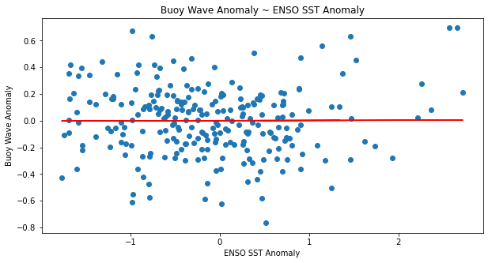
    


```python
m, b = np.polyfit(anom_df.buoy_sst_anom, anom_df.buoy_wave_anom, 1)
plt.figure(figsize = (10, 5))
plt.scatter(anom_df.buoy_sst_anom, anom_df.buoy_wave_anom)
plt.plot(anom_df.buoy_sst_anom, m * anom_df.buoy_sst_anom + b, color = 'red')
plt.title('Buoy Wave Anomaly ~ Buoy SST Anomaly')
plt.ylabel('Buoy Wave Anomaly')
plt.xlabel('Buoy SST Anomaly')
```


    Text(0.5, 0, 'Buoy SST Anomaly')


    
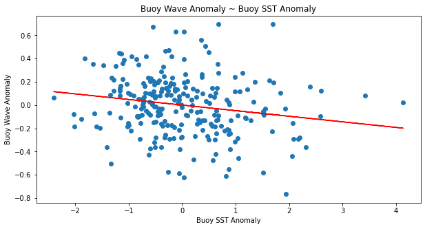
    


#### Results

Our model shows a positive correlation between ENSO sea surface temperature anomaly and Santa Barbara sea surface temperature anomaly. The model output indicates that this correlation is statistically significant based on the p-value, but the low $R^2$ value of 0.282 estimates that temperature near the equator only accounts for approximately 28% of the variability in sea surface temperature near Santa Barbara.Buoy height wave anomaly only has a slight positive correlation with ENSO sea surface temperature anomaly, but these results were not statistically significant due to a p-value > 0.05. The model for buoy wave height vs. buoy sea surface temperature was statistically significant (p-value < 0.05, but based on the $R^2$ value, buoy sea surface temperature anomaly accounts for only 3.5% of the variability observed in wave height..


#### Future Work

Further analyses with these datasets could look at correlations on a larger spatial scale by comparing results for other buoy stations closer to and further from the equator than Santa Barbara. The CDIP datasets can also be used to model the effect of ENSO on wave direction.

<a id='references'></a> 

### References

References used to create this tutorial include:

1. Coastal Data Information Program (CDIP): https://cdip.ucsd.edu/
2. Coastal Data Information Program (CDIP) data access documentation: https://cdip.ucsd.edu/m/documents/data_access.html
3. Harvest bouy, station 071: https://cdip.ucsd.edu/m/products/?stn=071p1 

**Buoy Data citation:** Data furnished by the Coastal Data Information Program (CDIP), Integrative Oceanography Division, operated by the Scripps Institution of Oceanography, under the sponsorship of the U.S. Army Corps of Engineers and the California Department of Parks and Recreation

**ENSO Data citation:** Data made publicly available by the National Weather Service's Climate Prediction Center. The data used: Monthly ERSSTv5 (1991-2020 base period) Niño 3.4 (5°North-5°South)(170-120°West)
