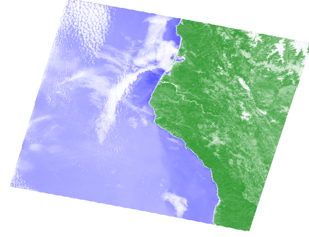

## Purpose

This analysis was done in order to get familiar with the [Google Earth Engine Python API](https://developers.google.com/earth-engine/tutorials/community/intro-to-python-api-guiattard). To run this code, an account with Google Earth Engine is required and student licences are available for free. 

### 1. Choose A Study Region

For this project I am choosing Arcata California. This is where I attended college, and I chose to go there for it's rural location and its proximity to a variety of outdoor recreation areas. Arcata is a situated along the northern coast of California. The coastal zone surrounding the town includes beautiful coast redwoods (_Sequoia sempervirens_), Humboldt Bay, and low-lying areas around Humboldt Bay. Going east from the coastal zone, you quickly gain elevation and enter the southern Cascade mountain range and the Trinity Alps. This region contains the volcanoes Mt. Shasta and Mt Lassen, formed by the Cascadia subduction zone. Arcata's climate falls into the temperate rainforest category, and is dominated by a rainy season and a dry season. Arcata's population is also somewhat seasonal thanks to the college population leaving for the summer months. 

### 2. Locate A Precipitation Dataset

Take a look through the Google Earth Engine [data catalog](https://developers.google.com/earth-engine/datasets).
    
I chose the the ERA5 Daily Aggregates dataset because my other choice Global Precipitation Measurement (GPM) v6 kept exceeding my user memory limit. I also investigated many other datasets (test_1 to test_5 files) but I did not really like how a few of them looked in comparison. I think the ERA5 Daily Aggregates suited my needs quite well and showed the scope of the storm event I was looking at quite well. It feels a bit like cheating, but I really did try to use other datasets. This dataset also gives reasonable spatial resolution. 

```python
# Import packages
import ee
import geemap
import pandas as pd
import matplotlib.pyplot as plt
import numpy as np
from IPython.display import Image
ee.Initialize()
```

```python
gdat = ee.ImageCollection('ECMWF/ERA5/DAILY')
gdat_prop = gdat.propertyNames().getInfo()
pr = gdat.select('total_precipitation')
prdflt = pr.filter(ee.Filter.date('2019-02-24', '2019-02-28')).sum();
prdflt.getInfo()
```

    {'type': 'Image',
     'bands': [{'id': 'total_precipitation',
       'data_type': {'type': 'PixelType', 'precision': 'double'},
       'crs': 'EPSG:4326',
       'crs_transform': [1, 0, 0, 0, 1, 0]}]}


### 3. Plot a Time Series of Precipitation

Let's do a new type of analysis on the data: the creation of a time series. 

```python
ar_lon = -124
ar_lat = 40.8
ar_poi = ee.Geometry.Point(ar_lon, ar_lat)
scale = 1000   # scale in m
ar_pr_ts = pr.getRegion(ar_poi, scale).getInfo()
df = pd.DataFrame(ar_pr_ts)
print(df)
```

                  0          1          2              3                    4
    0            id  longitude   latitude           time  total_precipitation
    1      19790102 -123.99895  40.796989   284083200000                    0
    2      19790103 -123.99895  40.796989   284169600000                    0
    3      19790104 -123.99895  40.796989   284256000000             0.002583
    4      19790105 -123.99895  40.796989   284342400000                    0
    ...         ...        ...        ...            ...                  ...
    15161  20200705 -123.99895  40.796989  1593907200000             0.000057
    15162  20200706 -123.99895  40.796989  1593993600000             0.000298
    15163  20200707 -123.99895  40.796989  1594080000000             0.000005
    15164  20200708 -123.99895  40.796989  1594166400000              0.00015
    15165  20200709 -123.99895  40.796989  1594252800000             0.000015
    
    [15166 rows x 5 columns]
    


```python
headers = df.loc[0]     # Assign the first entry in the data frame to a variable called "headers"
print(headers) 
```

    0                     id
    1              longitude
    2               latitude
    3                   time
    4    total_precipitation
    Name: 0, dtype: object
    

```python
df = pd.DataFrame(df.values[1:], columns=headers)      
# Make a new data frame out of the old one, but assigning the names we just retrieved as actual column headers
print(df)  
```

    0            id  longitude   latitude           time total_precipitation
    0      19790102 -123.99895  40.796989   284083200000                   0
    1      19790103 -123.99895  40.796989   284169600000                   0
    2      19790104 -123.99895  40.796989   284256000000            0.002583
    3      19790105 -123.99895  40.796989   284342400000                   0
    4      19790106 -123.99895  40.796989   284428800000                   0
    ...         ...        ...        ...            ...                 ...
    15160  20200705 -123.99895  40.796989  1593907200000            0.000057
    15161  20200706 -123.99895  40.796989  1593993600000            0.000298
    15162  20200707 -123.99895  40.796989  1594080000000            0.000005
    15163  20200708 -123.99895  40.796989  1594166400000             0.00015
    15164  20200709 -123.99895  40.796989  1594252800000            0.000015
    
    [15165 rows x 5 columns]
    

```python
df['datetime'] = pd.to_datetime(df['time'], unit = 'ms')
df
```

<div>
<style scoped>
    .dataframe tbody tr th:only-of-type {
        vertical-align: middle;
    }

    .dataframe tbody tr th {
        vertical-align: top;
    }

    .dataframe thead th {
        text-align: right;
    }
</style>
<table border="1" class="dataframe">
  <thead>
    <tr style="text-align: right;">
      <th></th>
      <th>id</th>
      <th>longitude</th>
      <th>latitude</th>
      <th>time</th>
      <th>total_precipitation</th>
      <th>datetime</th>
    </tr>
  </thead>
  <tbody>
    <tr>
      <th>0</th>
      <td>19790102</td>
      <td>-123.99895</td>
      <td>40.796989</td>
      <td>284083200000</td>
      <td>0</td>
      <td>1979-01-02</td>
    </tr>
    <tr>
      <th>1</th>
      <td>19790103</td>
      <td>-123.99895</td>
      <td>40.796989</td>
      <td>284169600000</td>
      <td>0</td>
      <td>1979-01-03</td>
    </tr>
    <tr>
      <th>2</th>
      <td>19790104</td>
      <td>-123.99895</td>
      <td>40.796989</td>
      <td>284256000000</td>
      <td>0.002583</td>
      <td>1979-01-04</td>
    </tr>
    <tr>
      <th>3</th>
      <td>19790105</td>
      <td>-123.99895</td>
      <td>40.796989</td>
      <td>284342400000</td>
      <td>0</td>
      <td>1979-01-05</td>
    </tr>
    <tr>
      <th>4</th>
      <td>19790106</td>
      <td>-123.99895</td>
      <td>40.796989</td>
      <td>284428800000</td>
      <td>0</td>
      <td>1979-01-06</td>
    </tr>
    <tr>
      <th>...</th>
      <td>...</td>
      <td>...</td>
      <td>...</td>
      <td>...</td>
      <td>...</td>
      <td>...</td>
    </tr>
    <tr>
      <th>15160</th>
      <td>20200705</td>
      <td>-123.99895</td>
      <td>40.796989</td>
      <td>1593907200000</td>
      <td>0.000057</td>
      <td>2020-07-05</td>
    </tr>
    <tr>
      <th>15161</th>
      <td>20200706</td>
      <td>-123.99895</td>
      <td>40.796989</td>
      <td>1593993600000</td>
      <td>0.000298</td>
      <td>2020-07-06</td>
    </tr>
    <tr>
      <th>15162</th>
      <td>20200707</td>
      <td>-123.99895</td>
      <td>40.796989</td>
      <td>1594080000000</td>
      <td>0.000005</td>
      <td>2020-07-07</td>
    </tr>
    <tr>
      <th>15163</th>
      <td>20200708</td>
      <td>-123.99895</td>
      <td>40.796989</td>
      <td>1594166400000</td>
      <td>0.00015</td>
      <td>2020-07-08</td>
    </tr>
    <tr>
      <th>15164</th>
      <td>20200709</td>
      <td>-123.99895</td>
      <td>40.796989</td>
      <td>1594252800000</td>
      <td>0.000015</td>
      <td>2020-07-09</td>
    </tr>
  </tbody>
</table>
<p>15165 rows × 6 columns</p>
</div>


```python
plt.figure(figsize = (10, 6), dpi = 300)    # create a new figure, set size and resolution (dpi)
plt.plot(df['datetime'],df['total_precipitation'])   # add data to the plot
plt.title('Arcata Rainfall', fontsize=16)
plt.xlabel('Date', fontsize=14)
plt.ylabel('Precip (m)', fontsize=14)
plt.ylim(0, 0.12)
```

    (0.0, 0.12)

    


### 4. Make Some Maps of Interesting Times

I chose to take the sum of the time period I examined in order to look at how much precipitation there was over the Mad River watershed. The sum of the values also lets you see the total amount of precipitation over the entire time period of the storm event. My map shows heavy precipitation over the Pacific, making landfall in northern California and Oregon, while staying to the north and largely avoiding Nevada. 

```python
# Base map
Map = geemap.Map(center=[40.8,-124], zoom=6)
# Min and Max
VIS_PREC = {
    'min':0,
    'max':.02,
    'palette': ['#FFFFFF', '#00FFFF', '#0080FF', '#DA00FF', '#FFA400', '#FF0000']
}
# Add layer
Map.addLayer(prdflt, VIS_PREC,'total precipitation',opacity=0.3)
# Plot map
Map
```

    Map(center=[40.8, -124], controls=(WidgetControl(options=['position', 'transparent_bg'], widget=HBox(children=…

```python
pt = ee.Geometry.Point([-124.3652, 40.2922])
roi = pt.buffer(1600000)
# Create a URL to the styled image for a region around Mendocino County CA.
url = prdflt.getThumbUrl({
    'min': 0, 'max': .02, 'dimensions': 512, 'region': roi, 'opacity': 0.3,
    'palette': ['#FFFFFF', '#00FFFF', '#0080FF', '#DA00FF', '#FFA400', '#FF0000']})
Image(url=url, embed=True, format = 'png')
```


### 5. Plot Landsat NDVI for the Region

The precipitation analysis discussed above provides useful context for identifying interesting weather events for a particular region. Now let's see what (if any!) effect changes in weather patterns have had on the landscape, using Landsat imagery. 

I was able to see a slight difference in the two images. It is unclear to me if the long term average includes more cloud cover and is therefore less bright/vivid, or if the rain increased the vegetation. If I had to guess I would say that there was not a very noticeable change because I chose an area that is already very wet and productive. 

```python
land_8 = ee.ImageCollection('LANDSAT/LC08/C01/T1_TOA')
pt = ee.Geometry.Point([-124, 40.8])   # Point corresponding to Arcata, CA
land_8_pt = land_8.filterBounds(pt)
land_8_least_cld = land_8_pt.filter('CLOUD_COVER < 20').mean();
red = land_8_least_cld.select('B4')
nir = land_8_least_cld.select('B5')
ndvi=(nir.subtract(red)).divide((nir.add(red))).rename('NDVI')
ndvi
```

    <ee.image.Image at 0x22d22b1b280>

```python
ndviParams = {'min': -1, 
              'max': 1, 
              'palette': ['blue', 'white', 'green']
             }
```

```python
#  Interactive only, no saved output
Map_NDVI = geemap.Map(center=[40.8, -124], zoom=8)
Map_NDVI.addLayer(ndvi, ndviParams,'NDVI')
Map_NDVI
```

    Map(center=[40.8, -124], controls=(WidgetControl(options=['position', 'transparent_bg'], widget=HBox(children=…


```python
pt = ee.Geometry.Point([-124.3652, 40.2922])
roi = pt.buffer(120000)
# Create a URL to the styled image for a region around Mendocino County CA.
url = ndvi.getThumbUrl({
    'min': -1, 'max': 1, 'dimensions': 512, 'region': roi,
    'palette': ['blue', 'white', 'green']})
Image(url=url, embed=True, format = 'png')
```


    

```python
land_8_least_cld_flt = land_8_pt.filter('CLOUD_COVER < 20')
land_8_least_cld_flt_dt = land_8_least_cld_flt.filter(ee.Filter.date('2019-01-01', '2019-04-28')).mean();
red_2 = land_8_least_cld_flt_dt.select('B4')
nir_2 = land_8_least_cld_flt_dt.select('B5')
ndvi_2 = (nir_2.subtract(red_2)).divide((nir_2.add(red_2))).rename('NDVI')
ndvi_2
```

    <ee.image.Image at 0x22d220f6820>


```python
#  Interactive only, no saved output
Map_NDVI_flt = geemap.Map(center=[40.8, -124], zoom=8)
Map_NDVI_flt.addLayer(ndvi_2, ndviParams,'NDVI')
Map_NDVI_flt
```


    Map(center=[40.8, -124], controls=(WidgetControl(options=['position', 'transparent_bg'], widget=HBox(children=…


```python
pt = ee.Geometry.Point([-124.3652, 40.2922])
roi = pt.buffer(120000)
# Create a URL to the styled image for a region around Mendocino County CA.
url = ndvi_2.getThumbUrl({
    'min': -1, 'max': 1, 'dimensions': 512, 'region': roi,
    'palette': ['blue', 'white', 'green']})
Image(url=url, embed=True, format = 'png')
```


