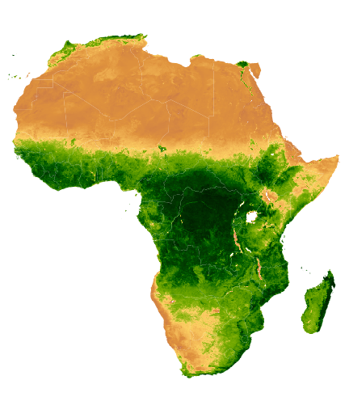
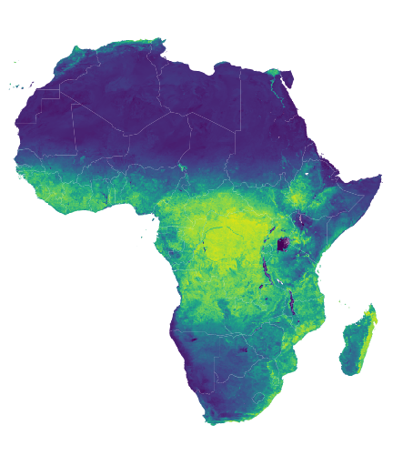
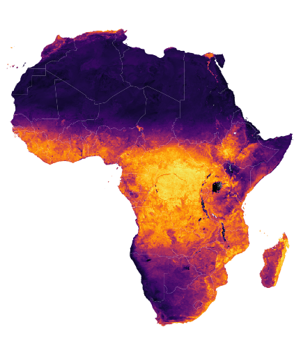
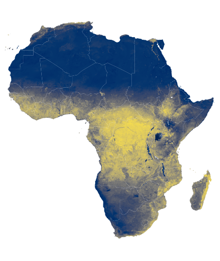

```{r setup, include=FALSE}
knitr::opts_chunk$set(echo = FALSE)
```

# NDVI Static Images

The following code is adapted from a Google Earth Engine [JavaScript tutorial](https://developers.google.com/earth-engine/tutorials/community/modis-ndvi-time-series-animation). The code was translated into python, made static, and reproduced with several color palettes. The python code is found on the [CropMOSAIKS GitHub](https://github.com/cropmosaiks/NDVI_Images).

```python
import ee
from IPython.display import Image
```


```python
ee.Initialize()
```


```python
ndvi = ee.ImageCollection('MODIS/006/MOD13A2').select('NDVI')
```


```python
mask = ee.FeatureCollection('USDOS/LSIB_SIMPLE/2017').filter(ee.Filter.eq('wld_rgn', 'Africa'))
```


```python
region = ee.Geometry.Polygon(
  [
      [
          [-19.698368046353494, 38.1446395611524],
          [-19.698368046353494, -36.16300755581617],
          [53.229366328646506, -36.16300755581617],
          [53.229366328646506, 38.1446395611524]
      ]
  ]
)
```


```python
ndvi = ndvi.filterDate('2013-01-01', '2014-01-01')
```


```python
ndvi = ndvi.reduce(ee.Reducer.median())
```


```python
ndvi = ndvi.clip(mask)
```


```python
natural = [
    'FFFFFF', 'CE7E45', 'DF923D', 'F1B555', 'FCD163', '99B718', '74A901',
    '66A000', '529400', '3E8601', '207401', '056201', '004C00', '023B01',
    '012E01', '011D01', '011301'
]
viridis = [
    "#440154FF", "#48186AFF", "#472D7BFF", "#424086FF", "#3B528BFF", "#33638DFF", 
    "#2C728EFF", "#26828EFF", "#21908CFF", "#1F9F88FF", "#27AD81FF", "#3EBC74FF",
    "#5DC863FF", "#82D34DFF", "#AADC32FF", "#D5E21AFF", "#FDE725FF"
]
magma = [
    "#000004FF", "#0B0724FF", "#210C4AFF", "#3D0965FF", "#56106EFF", "#71196EFF", 
    "#89226AFF", "#A32C61FF", "#BB3754FF", "#D14545FF", "#E35932FF", "#F1721EFF",
    "#F98C0AFF", "#FCAA0FFF", "#F9C932FF", "#F2E865FF", "#FCFFA4FF"
]
cividis = [
    "#00204DFF", "#002C69FF", "#05366EFF", "#2D426CFF", "#414D6BFF", "#52596CFF", 
    "#61646FFF", "#6F7073FF", "#7C7B78FF", "#8B8779FF", "#9B9477FF", "#ACA174FF",
    "#BCAF6FFF", "#CEBC68FF", "#E0CB5EFF", "#F2DA50FF", "#FFEA46FF"
  ]
```


```python
#  # Closer to True color
visParams = {
  'min': 0.0,
  'max': 9000.0,
  'dimensions': 512,
  'region': region, 
  'opacity': 1,
  'palette': natural
}
```


```python
url = ndvi.getThumbUrl(visParams)
Image(url=url, embed=True, format = 'png')
```


    

    


```python
# # Viridis
visParams = {
  'min': 0.0,
  'max': 9000.0,
  'dimensions': 512,
  'region': region, 
  'opacity': 1,
  'palette': viridis
}
```


```python
url = ndvi.getThumbUrl(visParams)
Image(url=url, embed=True, format = 'png')
```


    

    


```python
visParams = {
  'min': 0.0,
  'max': 9000.0,
  'dimensions': 512,
  'region': region, 
  'opacity': 1,
  'palette': magma
}
```


```python
url = ndvi.getThumbUrl(visParams)
Image(url=url, embed=True, format = 'png')
```


    

    


```python
visParams = {
  'min': 0.0,
  'max': 9000.0,
  'dimensions': 512,
  'region': region, 
  'opacity': 1,
  'palette': cividis
}
```


```python
url = ndvi.getThumbUrl(visParams)
Image(url=url, embed=True, format = 'png')
```


    

    

