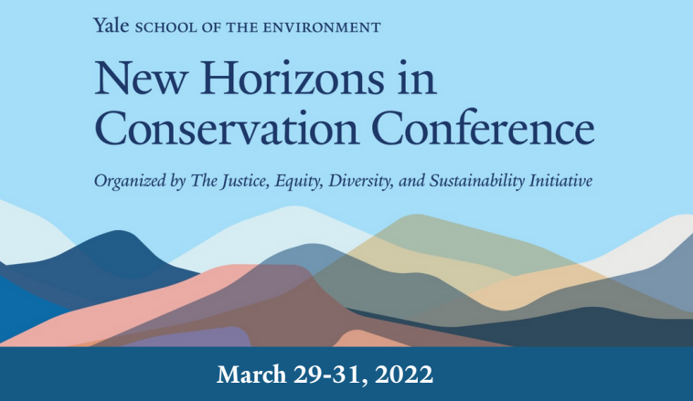

```{r setup, include=FALSE}
knitr::opts_chunk$set(echo = FALSE)
```

<center>

{width=99%}

</center>

### An open-source pipleline for remote sensing of crop yields under environmental change in sub-Saharan Africa

#### ABSTRACT: 

The environmental and social impacts of climate change are disproportionately distributed worldwide. Many highly impacted regions lack the assets to monitor and generate resource predictions, and therefore lack high-quality environmental and social data. As a result, it is difficult to make predictions about the impacts of climate change for these regions using conventional modeling. Recently, machine learning approaches applied to high-resolution satellite imagery have been successful in making predictions of a wide range of social and environmental variables. However, generating these predictions comes with significant barriers, including high computational, data storage, expertise, and financial resource costs. Reducing the financial and computational burden of machine learning approaches is essential to increasing the equity of environmental monitoring processes and outputs. Sub-Saharan Africa is one of these data-limited regions and is likely to suffer some of the largest impacts from climate change globally. To enable increased monitoring and data access across the sub-continent, we apply the novel machine learning approach, MOSAIKS, to create tabular features for sub-Saharan Africa using satellite imagery. These features, paired with ground-truth crop data from three countries, will be used to build a model that predicts crop yields over time in regions without crop data. This model will provide new insights into the historical crop yields of the region. Furthermore, these tabular features of satellite imagery, and the methodology developed to create them, will enable more people around the globe to build models and generate predictions of other social and environmental variables in this region.

#### Video submission  

<center>

{width=99%}

</center>

#### Poster submission  

<center>

{width=99%}

</center>

Please feel free to contact my team at **cp-cropmosaiks.bren.ucsb.edu** or inspect our code in our github organization, [cropMOSAIKS](https://github.com/cropmosaiks). Thanks!


