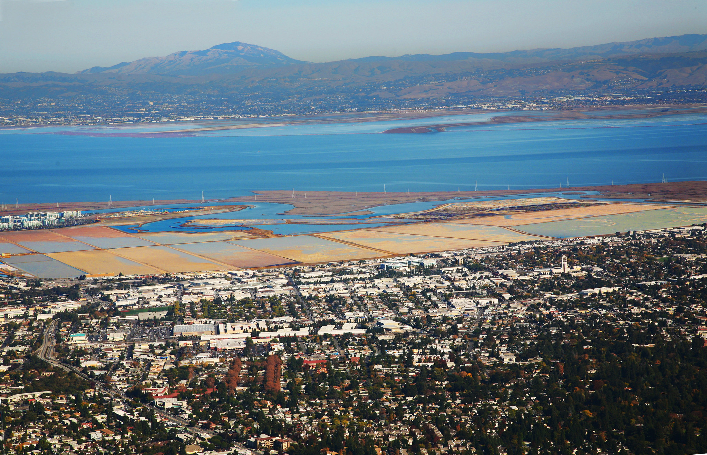
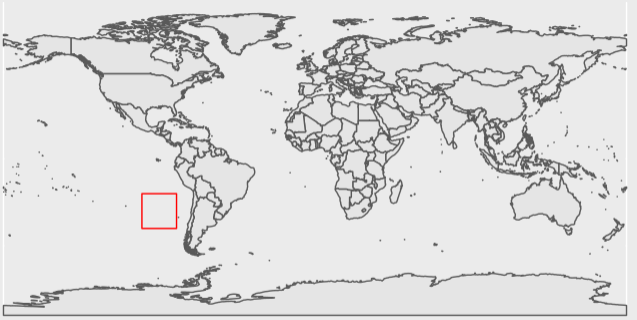
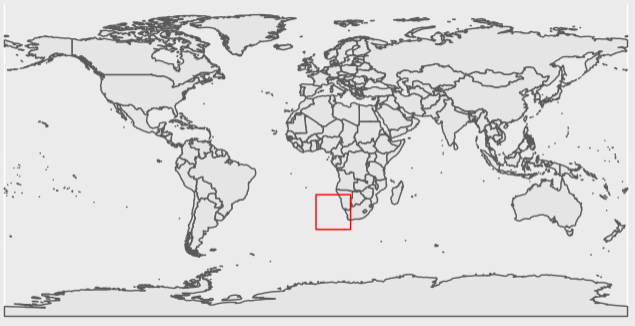

# Tidal flat Data

While working with the Ocean Health Index (OHI) during my summer fellowship, I was tasked with exploring and summarizing data that we wanted to integrate into the program to update the [habitat](https://oceanhealthindex.org/goals/biodiversity/habitats/) subgoal of [biodiversity](https://oceanhealthindex.org/goals/biodiversity/). This data was for tidal flat ecosystems to complement the existing habitat types. Tidal flat habitat is defined as sand, rock, or mud flats that undergo regular tidal inundation. This vital habitat is distributed globally, but up until this recently there was very limited data on the extent of these ecosystems, especially at the global scale.

The data come from a paper, [The global distribution and trajectory of tidal flats](https://www.nature.com/articles/s41586-018-0805-8) (Murray et al. 2019), which used satellite imagery and machine learning methods to classify tidal flat habitat from over 700,000 satellite images between 1984 and 2016. 

This new dataset has given OHI the opportunity to further improve their methods and in turn, the ability to understand the health of the world's oceans. For example, the paper found that: 

> "Extensive degradation from coastal development, reduced sediment delivery from major rivers, sinking of riverine deltas, increased coastal erosion, and sea-level rise signal a continuing negative trajectory for tidal flat ecosystems around the world."



&nbsp;&nbsp;&nbsp;&nbsp; *The interface of coastal development with tidal flat habitat off Redwood City, California (Photo: [Jitze Couperus](https://www.flickr.com/photos/jitze1942/5244615529/in/photolist-8Zs2tF-2mcBSEz-2mbaQWz-2eGrCBb-2mcR9AJ-riuRXd-2m9pjVX-dfpp5f-2ni8fyW-2maeZuS-237cW2k-2mbDn5Z-2mbfbXK-ZRJNMp-2mbvHuj-2mbaigy-2m9okJm-2m9KhCq-2ma4UN8-2maC7zZ-2m9H5Uu-2mb6sxZ-5A7XK2-SCXCLN-mEucZb-2mcJVgv-SCXCuA-5Q9qm-5qWU36-SCXCHG-r4fDrf-2maKF6K-2mbKNm7-2maWHYx-SCXC9f-of2jqp-PagPZo-24aBQVg-aMC5Jz-oJMgpT-9gsEyT-VRTZsv-P5Aez8-xsSKEo-3Yz3Si-YT1xo3-24Z2DH7-xbXZ3Q-qDc4vo-2kSmqmB))*.

Tidal flats will affect the OHI global scores by adding additional layers to the habitat subgoal and carbon storage goal. The three new data layers created are tidal flat extent (measured in $km^2$), tidal flat trend (proportional change), and tidal flat condition (current status compared to historic status).

This post will give a brief explanation of tidal flat habitat, explore the new dataset, and demonstrate how to programmatically summarize the data in the R software environment. The goal of data summarization is to distill the large raster dataset into simple tabular data which can be integrated into the OHI annual analysis as new data layers for 2022 and beyond.  

## Data exploration  

The published data product includes 11 sets (1 for each time step) of global tidal flat extent maps at 30 meter Ground Sample Distance (GSD; AKA resolution). This means that each pixel in each raster represents 30 m<sup>2</sup>, and contains either 0 for "not tidal flat", or 1 for "tidal flat." This is a massive amount of data, but thankfully, each of the 11 time steps were broken into 108 files with discrete spatial extents, making individual files easy to work with. 

So where to begin? Well first, we needed to access the data. The authors provide several options for [data access](https://www.intertidal.app/download) including through [Google Earth Engine](https://developers.google.com/earth-engine/datasets/tags/tidal-flats), [UNEP-WCMC Ocean Data Viewer](https://data.unep-wcmc.org/datasets/47), and finally through [direct download](https://www.intertidal.app/download/direct-download). We chose the direct download option and wrote a simple shell script that is executed in an R Markdown code chunk. 

```bash
### Make the new directory and move into it
mkdir /<path>/<to>/<directory>/<of>/<choice>/tidal_flats && cd $_

### Declare an array of strings, one for each time step
declare -a StringArray=(
  "1984-1986" "1987-1989" "1990-1992" "1993-1995" "1996-1998" 
  "1999-2001" "2002-2004" "2005-2007" "2008-2010" "2011-2013" 
  "2014-2016"
)

### Iterate through the array using for loop
for val in ${StringArray[@]}; do
  echo $val
  wget https://storage.googleapis.com/uq-intertidal/v1_1/global_intertidal/$val.zip
  unzip $val.zip -d ./$val
  rm $val.zip
done
```

With the data in hand, we first do some basic exploration and ensure it is what we expect, and that it makes sense. The `terra` package has some handy functions for doing this. After reading the first file of the first time step with `terra::rast()`, I used `terra::freq()` to check how many unique values there were, expecting only 0 or 1 based on the metadata. 

```r
image <- here::here("tidal_flats", "1984-1986", "-100_-20.tif") %>% 
  terra::rast() 
image # print the raster metadata
``` 

<details>
<summary>
Output (raster metadata)
</summary>

```console
class       : SpatRaster 
dimensions  : 74213, 74213, 1  (nrow, ncol, nlyr)
resolution  : 0.0002694946, 0.0002694946  (x, y)
extent      : -160, -140, -20, 0  (xmin, xmax, ymin, ymax)
coord. ref. : lon/lat WGS 84 (EPSG:4326) 
source      : -160_0.tif 
name        : classification
```
</details>

```r
terra::freq(image)
```

<details>
<summary>
Output (frequency table)
</summary>

```console
     layer value      count
[1,]     1     0 5507569369
```
</details>

Dang! All 0's. This is most likely due to the spatial tile not intersecting any intertidal region. There will be many tiles over nothing but ocean or land. While not a satisfying result for our first data exploration, it is important to anticipate what you are looking for and what you might find. Lets take a look at this files spatial extent in relation to the global coastline to make sure that our results match what we now expect of it. 

```r
library(rnaturalearth)
library(rnaturalearthdata)
library(tidyterra)

world <- ne_countries(scale = "medium", returnclass = "sf")

extent <- terra::ext(image)

extent_polygon <- terra::as.polygons(extent)

terra::crs(extent_polygon) <- "epsg:4326"

ggplot(data = world) +
  geom_sf() +
  tidyterra::geom_spatvector(data = extent_polygon, color = "Red", fill = NA)
``` 

<center>

</center>

Looks like our intuition matches the result! This plot shows the extent only covers open ocean. 

Now lets examine another raster to see what kind of unique value we get. 

```r
image <- here::here("tidal_flats", "1984-1986", "0_-20.tif") %>% 
  terra::rast() %>% 
  terra::freq()
``` 

<details>
<summary>
Output (frequency table)
</summary>

```console
     layer value      count
[1,]     1     0 5506916280
[2,]     1     1     653089
```
</details>

That is better! Now lets see where this file lands on the globe. 

```r
extent_polygon <- terra::ext(image) %>% 
  terra::as.polygons()

terra::crs(extent_polygon) <- "epsg:4326"

ggplot(data = world) +
  geom_sf() +
  tidyterra::geom_spatvector(data = extent_polygon, color = "Red", fill = NA)
``` 

<center>

</center>

Now we can see that this tile falls along a section of coastline, and has both 0 and 1 values. Things look good so far. 

## Transforming the data

Now that we know our files contain what we expect, and have seen a few outputs, it is time to design a workflow that will allow us to extract the information we want from the files. For OHI, our goal is to summarize the extent of habitat in each region, for each time step. Our ideal final product will have an extent measured in $km^2$, the region ID, the year, and the habitat type. 

Even though each time step is broken into 108 files, the resolution still makes this data hard to work with. The `terra` package offers a solution to reduce resolution, often referred to as down-sampling. The function `terra::aggregate()` allows a user to specify how many pixels should be connected into one and what function to use on the pixels being aggregated. In our case we want to sum the pixels to retain all of the habitat information. We want to choose a resolution that will allow us to continue using the rasters for analysis without bogging down our computer. We chose to down-sample to ~1 $km^2$ resolution by choosing 30 pixels as our aggregation factor. Our function then looks like:

```r
down_sampled_image <- terra::aggregate(
  x = image, 
  fact = 30, 
  fun = sum, 
  na.rm = T
)
```

The true resolution in $km^2$ can be found with a bit of simple math, 30 meters by 30 pixels is 900 meters to a side, and squaring that gives our new pixel dimensions of $900 x 900$ meters. We then divide these new dimensions by by a pixel with an area of 1 $km^2$: 
$$\frac{900 * 900}{1,000 * 1,000}  = .81 \text{ }km^2$$
Using 33 pixels would have brought us closer to 1 $km^2$, but this brings the image to a reasonable size, and in general we would like to keep the resolution as high as possible. 

Our next goal is to convert pixel counts into area. If the native raster cells are 30 x 30 meters, then a raster cell with a value of 1 would be equivalent to 0.0009 $km^2$ habitat area. This can be found by multiplying the pixel dimensions together and dividing by a pixel with an area of 1 $km^2$:
$$\frac{30 * 30}{1,000 * 1,000}  = 0.0009 \text{ }km^2$$
The simplest way to convert to area in this scenario is to simply multiply our down-sampled raster by 0.0009. 

```r
down_sampled_image <- down_sampled_image * 0.0009
```

This works because each pixel started out as a 0 or a 1, so the aggregated raster has values in multiples of 1. We can check this by again using `terra::freq()` to see that our new raster has values in multiples of 0.0009. We use the `digits` argument to make sure values are not rounded to 0 in the output table. 

```r
terra::freq(
  down_sampled_image, 
  digits = 6
) 
```

<details>
<summary>
Output (frequency table)
</summary>

```console
     layer  value   count
[1,]     1 0.0000 6117245
[2,]     1 0.0009      61
[3,]     1 0.0018      59
(cropped for brevity)
```
</details>

Results look good! Just as expected, we now have raster cells at ~1 $km^2$ resolution, with cell values representing the area in $km^2$ of tidal flat habitat. In this case there are 61 cells which contained a single cell of tidal flat, prior to aggregation, 59 which had two, and so on.

Now we need to extract the values that fall with each OHI region polygon. To do this we use another package new to OHI, `exactextractr`. As we saw in the previous post on soft bottom habitat analysis, this package allows us to extract values from polygons and return an estimate if a polygon goes through a raster cell. This is handy to implement after aggregation as it allows us to maintain a higher level of precision. The `raster::extract()` function will only include a cell if the center of the cell falls inside a polygon. Our shapefile has separate polygons for all regions' EEZ's and for their land area. We want to use both because our data primarily goes through the intersection of these two polygons. 

The first thing we need to do is [download](https://oceanhealthindex.org/global-scores/data-download/) the OHI region [polygon file](https://mazu.nceas.ucsb.edu/data/). 

```bash
mkdir /<path>/<to>/<directory>/<of>/<choice>/regions && cd $_
wget https://ohi.nceas.ucsb.edu/data/data/regions.zip
unzip regions.zip 
rm regions.zip
```

Next we read in the data and filter for what we want. We also create a dummy dataframe to use when reconstructing the extracted values into a usable data format. 

```r
regions_eez_and_land <- here::here('regions', 'regions.shp') %>% 
  sf::read_sf() %>%
  dplyr::filter(rgn_type %in% c("eez", 'land')) %>% 
  sf::st_transform(crs = 4326)
  
dummy_df <- regions_eez_and_land %>% 
  tibble::as_tibble() %>% 
  dplyr::select(rgn_id, rgn_name) 
```

We use the sum of values in our extraction because our downsampled image has also been converted to area in each pixel. The sum will give us the total area inside each polygon. Our function to extract values then looks like:

```r
exactextractr::exact_extract(
 x = down_sampled_image, 
 y = regions_eez_and_land, 
 fun = 'sum'
)
```

## Putting it all together

Now that we have a workflow that has been tested on a single raster, all we have to do is design a loop that goes through each raster file and outputs a simple `.csv` file.

```r 
### Create an empty intermediate output folder
dir.create("int") 

tictoc::tic() # time this code 

folders <- here::here("tidal_flats") %>% 
  list.files()

j <- 1

### To run this code in parallel, 
### Uncomment next two lines and comment out one after
### You will loose the pretty output messages :(

# doParallel::registerDoParallel(11)
# foreach::foreach (dir = folders) %dopar% {

for (dir in folders) { 
  
  files <- here::here("tidal_flats", dir) %>% 
    list.files()
  
  year = stringr::str_split(dir, pattern = "-", n = 2)[[1]][2]
  
  for (file in files){
    
    cat(j, "/", length(files), "\n")
    
    j <- j + 1
    
    fn <- file %>% 
      stringr::str_replace(
        pattern     = ".tif",
        replacement = paste0("_", year, ".csv"))
    
    ### make a new int folder to hold the output
    
    file_name <- here::here("int", "tidal_flat", fn)
    
    if(!file.exists(file_name)){
      
      cat(fn, " is being created!\n")
      
      cat("    down sampling...\n")
      
      image <- here::here("tidal_flats", dir, file) %>% 
        terra::rast() 
       
      down_sampled_image <- terra::aggregate(
        x = image, 
        fact = 30, 
        fun = sum,
        na.rm = T
      )

      cat("    converting to area (km2)...\n\n")
      
      down_sampled_image <- down_sampled_image * 0.0009
      
      cat("    extracting...\n")
      
      extracted_values <- exactextractr::exact_extract(
        x = down_sampled_image, y = regions_eez_and_land, fun = 'sum'
      )
      
      cbind("km2" = extracted_values, dummy_df) %>% 
        dplyr::group_by(rgn_id, rgn_name) %>% 
        dplyr::summarise(km2 = sum(km2)) %>% 
        dplyr::mutate(year = year, habitat = "tidal flat") %>% 
        readr::write_csv(file_name)
      
    } else {cat(paste0(fn, " already exists!\n"))}
  }
}
tictoc::toc()
```

There is a lot to take in there, but if you follow it line by line it isn't too bad. 

> __To recap:__  
> List raw data folders       
> Outer loop iterates through folders  
> List files in the folder  
> Find the year by splitting the folder name  
> Inner loop iterates through files in folder   
> Check if desired output already esists, if not, create it!  
> Create the SpatRaster  
> Down-sample resolution  
> Convert cell values to area  
> Extract area inside region polygons  
> Assign values to dummy dataframe 
> Summarize to the region level  
> Write the results!  

## Consolidate results

The end result of the above workflow produces a single `.csv` file for every raster in every time step with the extent of tidal wetland in every OHI region. We also know that each raster only covers a 1/108 chunk of the globe, which means there are a lot of 0 values in each of the files. These can be further condensed and summarized with a simple for loop. 

```r
### Create an empty output folder
dir.create("output")

### list csv files with extracted tidal flat values
files <- here::here("int", "tidal_flat") %>% 
  list.files(full.names = T)

### make an empty tibble to fill through iteration
output <- tibble::tibble()

### loop through files
for (file in files) {
  
  ### read in files, suppress messages with col_types argument
  tmp <- readr::read_csv(file, col_types = cols()) 
  
  ### bind temporary output to complete output
  output <- rbind(output, tmp) 
}

### summarize results and write final output
final <- output %>%
  dplyr::group_by(rgn_id, year, habitat) %>%
  dplyr::summarise(km2 = sum(km2, na.rm = T)) %>% 
  dplyr::filter(rgn_id != 213) %>% 
  readr::write_csv(here::here('output', "tidal_flat_extent.csv"))
```

Now we have a single `.csv` file with every OHI region  listed a single time for each time step, and a corresponding tidal flat extent for that region. This data is then used as a new layer when calculating the OHI scores. 

__[Check out the full data prep used in the 2022 OHI assessment here.](https://github.com/OHI-Science/ohiprep_v2022/tree/gh-pages/globalprep/hab_tidal_flat/v2022)__ 

# References

* Daniel Baston (2022). _exactextractr: Fast Extraction from Raster Datasets using Polygons_. R package version 0.8.2, <https://CRAN.R-project.org/package=exactextractr>.

* Hijmans R (2022). _terra: Spatial Data Analysis_. R package version 1.6-3, <https://CRAN.R-project.org/package=terra>.

* Murray, N.J., Phinn, S.R., DeWitt, M. et al. The global distribution and trajectory of tidal flats. Nature 565, 222–225 (2019). https://doi.org/10.1038/s41586-018-0805-8

* R Core Team (2022). R: A language and environment for statistical computing. R Foundation for Statistical Computing, Vienna, Austria. URL https://www.R-project.org/.

* Wickham H, Averick M, Bryan J, Chang W, McGowan LD, François R, Grolemund G, Hayes A, Henry L, Hester J, Kuhn M, Pedersen TL, Miller E, Bache SM, Müller K, Ooms J, Robinson D, Seidel DP, Spinu V, Takahashi K, Vaughan D, Wilke
  C, Woo K, Yutani H (2019). “Welcome to the tidyverse.” _Journal of Open Source Software_, *4*(43), 1686. doi:10.21105/joss.01686 <https://doi.org/10.21105/joss.01686>.
  