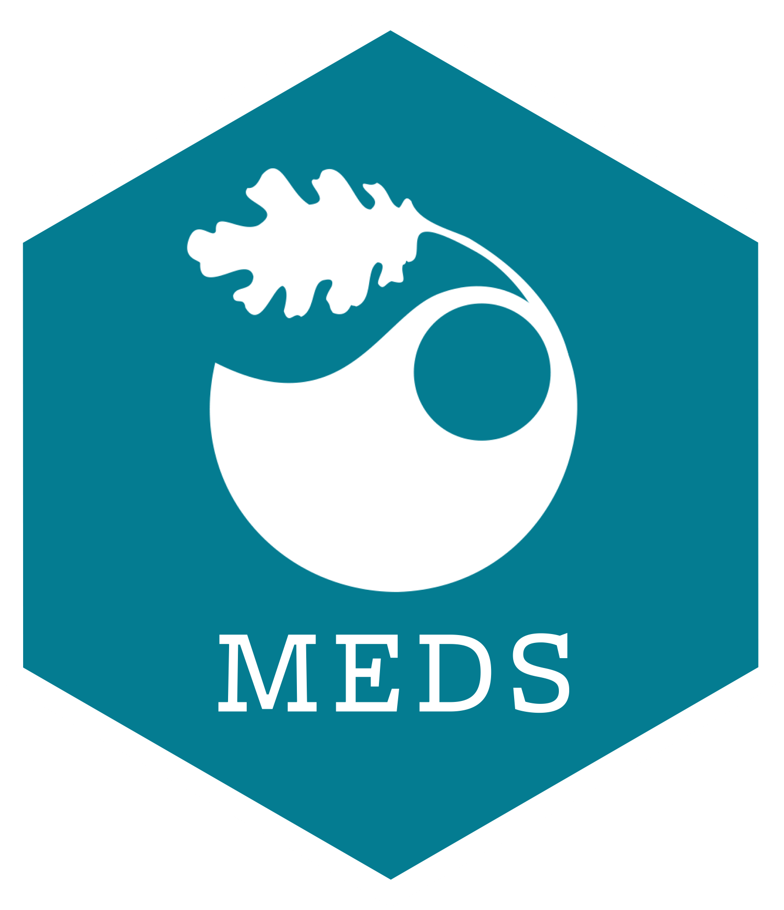

```{r setup, include=FALSE}
knitr::opts_chunk$set(echo = FALSE)
```


I am a marine ecologist with expertise in long term monitoring of kelp forest environments in California. I graduated from Humboldt State University in 2014 where I studied history, mathematics, and scientific diving. I enjoy outdoor activities such as mountain biking, camping, and freediving. I am currently a candidate in the Master of Environmental Data Science program at the Bren School of Environmental Science and Management at UCSB. I previously worked five seasons with Channel Islands National Park's Kelp Forest Monitoring Program (KFM) where I participated in underwater surveys of kelp forest communities. Through this work I developed my skills in subtidal field methods, data collection, data quality control, and database management. I enrolled in the MEDS program to learn data processing, data modeling, and data presentation to inform our understanding of community ecology. I am interested in how ecological communities change in response to environmental stressors such as climate patterns, fishing pressure, and disease events. I would like to return to work in marine ecology with data science skills that I can apply towards improving our understanding of these complex ecosystems. My goal is to produce products that effectively synthesize long term datasets in order to understand the processes which drive kelp forest communities, and ultimately share this understanding with the scientific community and the broader public.

<hr>

  |   |  
--- | --- | ---
 |  | 


