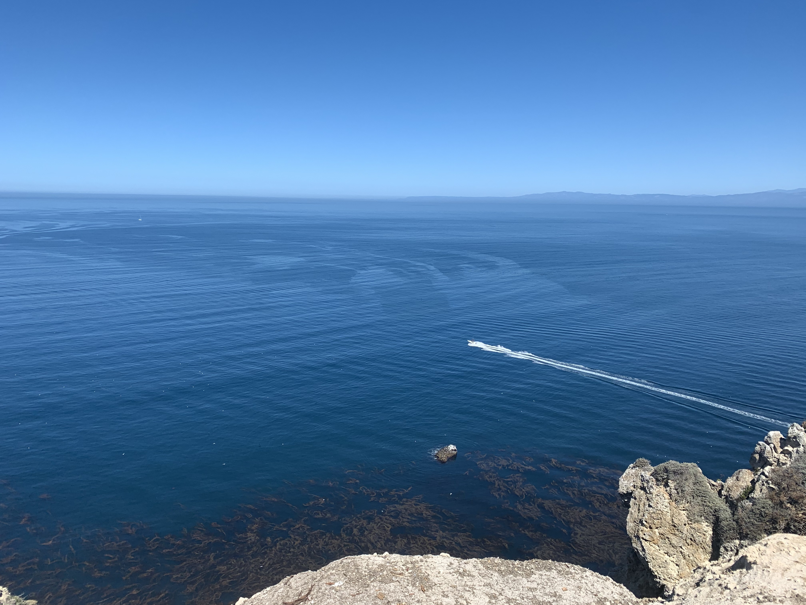
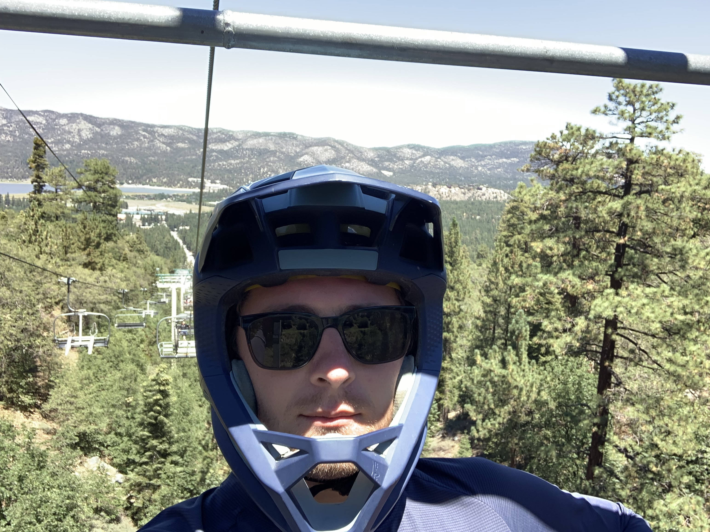
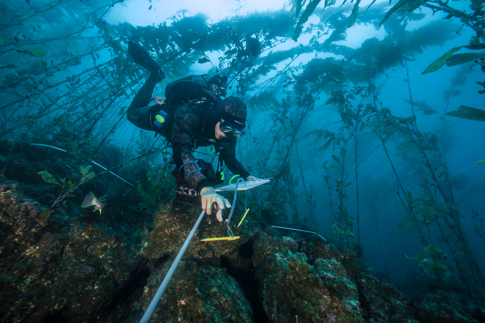

I am is a marine ecologist with expertise in long term monitoring of kelp forest environments in California. I graduated from Humboldt State University in 2014 where I studied history, mathematics, and scientific diving. I enjoys outdoor activities such as mountain biking, camping, and freediving. I am currently a master’s candidate of Environmental Data Science at the Bren School of Environmental Science and Management at UC Santa Barbara. I have worked five seasons with Channel Islands National Park's Kelp Forest Monitoring Program where I developed my skills in subtidal field methods, data collection, data quality control, and database management. I am interested in how ecological communities change in response to environmental stressors such as climate patterns, fishing pressure, and disease events. I aspire to continue working in marine ecology with expanded data processing, modeling, and presentation skills tp apply towards improving our understanding of these complex ecosystems. My goal is to produce products that effectively synthesize long term datasets to understand the processes which drive kelp forest communities, and ultimately share this understanding with the scientific community and the broader public. 

_Diving the wreck of the Yukon off the coast of San Diego California_

_Preparing to dive heavy gear at Santa Barbara City College_

_Diving heavy gear at Santa Barbara City College_

_Diving Southeast Reef, Santa Barbara Island_

_Diving Southeast Reef, Santa Barbara Island_

_Diving Southeast Reef, Santa Barbara Island_

_Preparing to dive surface supplied air at Cathedral Cove, Anacapa Island_

_Cycling up Gibraltar Road, Los Padres National Forest_

_Camping in Los Padres National Forest_

_Mountain Biking Mammoth Mountain_

_Cavern Point restoration project Santa Cruz Island_

_Mountain Biking Romero Canyon, Los Padres National Forest_

_Mountain Biking Big Bear, San Bernardino National Forest_

_Band transects at Admirals Reef, Anacapa Island_

_Band transects at Admirals Reef, Anacapa Island_

_Reef Check Calironia Survey, Van Damme Beach, Little River, California_